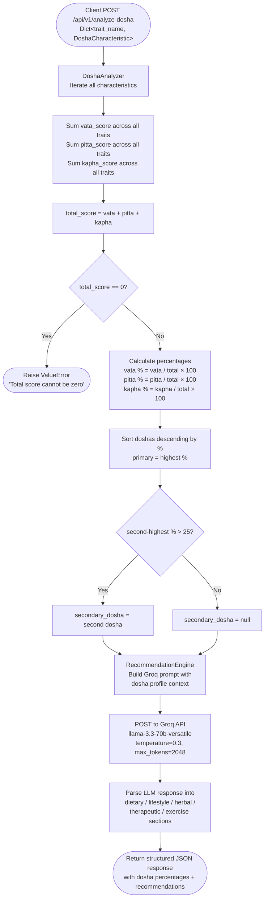

The **Analyze Dosha** endpoint is the core diagnostic tool in the AyurGuide API. You send a collection of trait observations — each scored independently across the three doshas — and the server calculates your Vata, Pitta, and Kapha percentages, identifies your primary and secondary doshas, then calls the Groq Llama-3.3-70b model to generate a structured set of Ayurvedic recommendations tailored to that exact dosha distribution.

## Base URL

| Environment  | Base URL                                             |
|--------------|------------------------------------------------------|
| Production   | `https://dva-mybackend-deployment.onrender.com`      |
| Self-hosted  | `http://localhost:8080`                              |

## Endpoint

```
POST /api/v1/analyze-dosha
```

## Request flow

The diagram below shows every step from your POST request to the final response.



## Request body

The request body is a **JSON object** whose keys are arbitrary trait identifiers (for example `"body_frame"` or `"digestion"`) and whose values are [`DoshaCharacteristic`](#schema-doshacharacteristic) objects. You may include as many traits as needed — the analyzer sums every score before computing percentages, so more traits produce more nuanced results.

### Schema — `DoshaCharacteristic`

<ParamField body="trait_name" type="string" required>
  A human-readable label for the physical or mental characteristic being assessed.  
  Examples: `"body_frame"`, `"skin_type"`, `"digestion"`, `"sleep"`, `"mental_tendency"`.
</ParamField>

<ParamField body="vata_score" type="integer" required>
  How strongly this trait reflects Vata qualities (air + ether). Must be `>= 0`.  
  Higher values indicate more Vata expression for this trait.
</ParamField>

<ParamField body="pitta_score" type="integer" required>
  How strongly this trait reflects Pitta qualities (fire + water). Must be `>= 0`.  
  Higher values indicate more Pitta expression for this trait.
</ParamField>

<ParamField body="kapha_score" type="integer" required>
  How strongly this trait reflects Kapha qualities (earth + water). Must be `>= 0`.  
  Higher values indicate more Kapha expression for this trait.
</ParamField>

<Note>
  Each `DoshaCharacteristic` score is relative — only the ratios between `vata_score`, `pitta_score`, and `kapha_score` within the full submission matter. You can use a 0–3 scale, a 0–10 scale, or any consistent integer scheme.
</Note>

### Example request

<CodeGroup>
```json JSON body
{
  "body_frame": {
    "trait_name": "body_frame",
    "vata_score": 3,
    "pitta_score": 1,
    "kapha_score": 0
  },
  "skin_type": {
    "trait_name": "skin_type",
    "vata_score": 2,
    "pitta_score": 3,
    "kapha_score": 0
  },
  "digestion": {
    "trait_name": "digestion",
    "vata_score": 1,
    "pitta_score": 3,
    "kapha_score": 1
  },
  "sleep": {
    "trait_name": "sleep",
    "vata_score": 3,
    "pitta_score": 1,
    "kapha_score": 0
  },
  "mental_tendency": {
    "trait_name": "mental_tendency",
    "vata_score": 3,
    "pitta_score": 2,
    "kapha_score": 0
  }
}
```

```bash cURL
curl -X POST https://dva-mybackend-deployment.onrender.com/api/v1/analyze-dosha \
  -H "Content-Type: application/json" \
  -d '{
    "body_frame":      { "trait_name": "body_frame",      "vata_score": 3, "pitta_score": 1, "kapha_score": 0 },
    "skin_type":       { "trait_name": "skin_type",       "vata_score": 2, "pitta_score": 3, "kapha_score": 0 },
    "digestion":       { "trait_name": "digestion",       "vata_score": 1, "pitta_score": 3, "kapha_score": 1 },
    "sleep":           { "trait_name": "sleep",           "vata_score": 3, "pitta_score": 1, "kapha_score": 0 },
    "mental_tendency": { "trait_name": "mental_tendency", "vata_score": 3, "pitta_score": 2, "kapha_score": 0 }
  }'
```

```python Python
import requests

payload = {
    "body_frame":      {"trait_name": "body_frame",      "vata_score": 3, "pitta_score": 1, "kapha_score": 0},
    "skin_type":       {"trait_name": "skin_type",       "vata_score": 2, "pitta_score": 3, "kapha_score": 0},
    "digestion":       {"trait_name": "digestion",       "vata_score": 1, "pitta_score": 3, "kapha_score": 1},
    "sleep":           {"trait_name": "sleep",           "vata_score": 3, "pitta_score": 1, "kapha_score": 0},
    "mental_tendency": {"trait_name": "mental_tendency", "vata_score": 3, "pitta_score": 2, "kapha_score": 0},
}

response = requests.post(
    "https://dva-mybackend-deployment.onrender.com/api/v1/analyze-dosha",
    json=payload,
)
print(response.json())
```
</CodeGroup>

## Response fields

<ResponseField name="status" type="string">
  Indicates whether the request succeeded. One of `"success"` or `"error"`.
</ResponseField>

<ResponseField name="data" type="object">
  Present on success. Contains the full dosha profile and recommendations.

  <Expandable title="data fields">
    <ResponseField name="data.primary_dosha" type="string">
      The dominant dosha — the one with the highest percentage across all submitted traits. One of `"vata"`, `"pitta"`, or `"kapha"`.
    </ResponseField>

    <ResponseField name="data.secondary_dosha" type="string | null">
      The second-ranked dosha if its percentage exceeds **25%**; otherwise `null`. See the [algorithm note](#secondary-dosha-algorithm) below.
    </ResponseField>

    <ResponseField name="data.vata_percentage" type="float">
      Vata's share of the total dosha score, rounded to two decimal places. Range: `0.00` – `100.00`.
    </ResponseField>

    <ResponseField name="data.pitta_percentage" type="float">
      Pitta's share of the total dosha score, rounded to two decimal places. Range: `0.00` – `100.00`.
    </ResponseField>

    <ResponseField name="data.kapha_percentage" type="float">
      Kapha's share of the total dosha score, rounded to two decimal places. Range: `0.00` – `100.00`.
    </ResponseField>

    <ResponseField name="data.recommendations" type="object">
      AI-generated Ayurvedic guidance structured into five sections. Each section is an array of strings.

      <Expandable title="recommendations sections">
        <ResponseField name="data.recommendations.dietary" type="array of strings">
          Foods to include or avoid, best consumption times, preparation tips, and quantity guidelines aligned with your dosha profile.
        </ResponseField>

        <ResponseField name="data.recommendations.lifestyle" type="array of strings">
          Daily routine adjustments, optimal activity windows, sleep practices, and practical implementation tips.
        </ResponseField>

        <ResponseField name="data.recommendations.herbal" type="array of strings">
          Specific herbs or Ayurvedic formulations with dosage, timing, preparation method, and expected benefits.
        </ResponseField>

        <ResponseField name="data.recommendations.therapeutic" type="array of strings">
          Classical Ayurvedic therapies (e.g., Abhyanga, Nasya, Shirodhara) with frequency, duration, and precautions.
        </ResponseField>

        <ResponseField name="data.recommendations.exercise" type="array of strings">
          Movement practices — type, intensity, duration, frequency, and the best time of day to perform them.
        </ResponseField>
      </Expandable>
    </ResponseField>
  </Expandable>
</ResponseField>

<ResponseField name="error" type="string | null">
  `null` on success. Contains a human-readable error message when `status` is `"error"`.
</ResponseField>

## Example responses

<CodeGroup>
```json Success (200)
{
  "status": "success",
  "data": {
    "primary_dosha": "vata",
    "secondary_dosha": "pitta",
    "vata_percentage": 57.89,
    "pitta_percentage": 31.58,
    "kapha_percentage": 10.53,
    "recommendations": {
      "dietary": [
        "Favour warm, oily, and grounding foods such as cooked root vegetables, ghee, and whole grains to pacify Vata.",
        "Avoid cold, dry, and raw foods — especially salads and chilled beverages — which aggravate Vata.",
        "Include cooling and mildly sweet foods like cucumber, coconut, and coriander to moderate Pitta.",
        "Eat at regular, consistent meal times to stabilise Vata's erratic digestive fire.",
        "Sesame oil used in cooking provides deep nourishment for Vata dryness."
      ],
      "lifestyle": [
        "Establish a fixed daily routine (Dinacharya) — consistent wake, meal, and sleep times are profoundly stabilising for Vata.",
        "Avoid excessive travel, screen time, and multitasking, all of which over-stimulate Vata.",
        "Practice self-massage (Abhyanga) with warm sesame oil each morning before bathing.",
        "Limit exposure to cold, dry, or windy environments whenever possible.",
        "Create a calm, warm sleeping environment; aim for 7–9 hours per night."
      ],
      "herbal": [
        "Ashwagandha (300–500 mg capsule or 1 tsp root powder in warm milk) taken at night to nourish and calm Vata.",
        "Triphala (1 tsp powder in warm water before bed) to regulate digestion and elimination.",
        "Shatavari (500 mg daily) to tonify tissues and counteract dryness.",
        "Brahmi ghee (1/4 tsp nasally or orally) to pacify the nervous system and Vata in the mind.",
        "Cumin-coriander-fennel (CCF) tea after meals to support Agni without inflaming Pitta."
      ],
      "therapeutic": [
        "Abhyanga (warm sesame oil full-body massage) twice weekly to nourish tissues and calm the nervous system.",
        "Shirodhara (steady oil stream over the forehead) monthly to deeply pacify Vata in the mind.",
        "Basti (medicated oil enema) — the primary Panchakarma therapy for Vata — consult a qualified practitioner.",
        "Nasya (nasal oil therapy with Anu Taila) each morning to lubricate the nasal passages and reduce Vata in the head."
      ],
      "exercise": [
        "Choose gentle, grounding practices: yoga (especially Yin or restorative), Tai Chi, and walking in nature.",
        "Exercise in the morning between 6 am and 10 am (Kapha time) to build warmth without over-stimulating Vata.",
        "Keep sessions moderate — 30–45 minutes at low to moderate intensity; excessive exertion depletes Vata types.",
        "Avoid high-impact aerobics, endurance running, and very cold outdoor exercise.",
        "Follow every workout with a short Savasana or seated meditation to ground Vata energy."
      ]
    }
  },
  "error": null
}
```

```json Error (200 envelope with error status)
{
  "status": "error",
  "data": null,
  "error": "Total score cannot be zero"
}
```
</CodeGroup>

<Warning>
  The API returns HTTP **200** even when processing fails. Always check the `status` field in the response body — a value of `"error"` means no dosha data was computed.
</Warning>

## Secondary dosha algorithm

The `secondary_dosha` field follows a strict threshold rule implemented in `DoshaAnalyzer.analyze_dosha()`:

1. All three dosha percentages are calculated from the summed scores.
2. The doshas are sorted in descending order by percentage.
3. The **highest** percentage dosha becomes `primary_dosha`.
4. The **second-highest** percentage dosha is compared against the 25% threshold:
   - If it is **strictly greater than 25%**, it is assigned to `secondary_dosha`.
   - If it is **25% or below**, `secondary_dosha` is set to `null`.

This means that `secondary_dosha` is only surfaced when there is a genuinely meaningful co-dominant influence — a second dosha scoring exactly 25% or less is considered subordinate enough to omit.

<Tip>
  When building a quiz UI, you can use the 25% threshold as a display guide: show "Vata-Pitta" dual-dosha messaging only when `secondary_dosha` is non-null.
</Tip>
