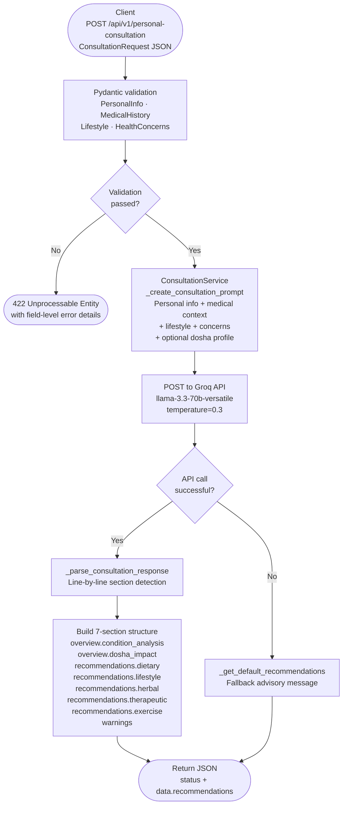

The **Personal Consultation** endpoint is the most comprehensive offering in the AyurGuide API. Unlike the dosha-analysis and pure-recommendation endpoints, it accepts a rich personal profile — including age, BMI, diagnosed medical conditions, current medications, activity level, stress, and your specific health concerns — and constructs a highly contextualised prompt that is sent directly to the Groq `llama-3.3-70b-versatile` model. The response is parsed into a structured seven-section JSON object covering everything from dosha impact and dietary guidance to herb prescriptions, therapeutic treatments, exercise plans, and explicit safety warnings. Use this endpoint when you want to give users a full, personalised Ayurvedic health plan rather than generic dosha-type advice.

## Base URL

| Environment  | Base URL                                             |
|--------------|------------------------------------------------------|
| Production   | `https://dva-mybackend-deployment.onrender.com`      |
| Self-hosted  | `http://localhost:8080`                              |

## Endpoint

```
POST /api/v1/personal-consultation
```

## Request flow



## Request body

The request body must be a valid JSON object matching the `ConsultationRequest` schema. All four top-level objects are required.

---

### `personal_info` (required)

<ParamField body="personal_info" type="object" required>
  Demographic and biometric details used to contextualise every recommendation.

  <Expandable title="personal_info fields">
    <ParamField body="personal_info.age" type="integer" required>
      Patient age in years. Must be between **1** and **120** (inclusive).
    </ParamField>

    <ParamField body="personal_info.gender" type="string" required>
      Biological or self-identified gender. Accepted values (case-insensitive): `"male"`, `"female"`, `"other"`. The server normalises the value to lowercase.
    </ParamField>

    <ParamField body="personal_info.weight" type="float" required>
      Body weight in **kilograms**. Must be between **20** and **200** kg.
    </ParamField>

    <ParamField body="personal_info.height" type="float" required>
      Height in **centimetres**. Must be between **100** and **250** cm.
    </ParamField>

    <ParamField body="personal_info.bmi" type="float" required>
      Body Mass Index. You must pre-calculate this before sending: `bmi = weight / (height / 100) ** 2`. The server uses the value you provide directly in the LLM prompt context.
    </ParamField>
  </Expandable>
</ParamField>

<Tip>
  Pre-compute BMI in your client with: `bmi = round(weight_kg / (height_cm / 100) ** 2, 1)`. Sending one decimal place (e.g. `24.3`) keeps the LLM prompt concise.
</Tip>

---

### `medical_history` (required)

<ParamField body="medical_history" type="object" required>
  Current conditions and medications that inform Ayurvedic contraindications and herbal compatibility.

  <Expandable title="medical_history fields">
    <ParamField body="medical_history.conditions" type="array of strings">
      List of diagnosed medical conditions. Defaults to an empty array if not provided. The engine recognises and enriches the following conditions with Ayurvedic context automatically:

      `"Diabetes"`, `"Hypertension"`, `"Arthritis"`, `"Digestive Issues"`, `"Respiratory Problems"`, `"Skin Conditions"`, `"Sleep Disorders"`, `"Stress/Anxiety"`.

      You may include any condition string — unrecognised conditions are passed to the LLM as-is.
    </ParamField>

    <ParamField body="medical_history.medications" type="string">
      A free-text description of current medications and dosages. Optional — omit or pass `null` if none. Used to surface herb-drug interaction warnings in the `warnings` section.
    </ParamField>
  </Expandable>
</ParamField>

---

### `lifestyle` (required)

<ParamField body="lifestyle" type="object" required>
  Current lifestyle habits that the AI uses to calibrate recommendations towards realistic, achievable changes.

  <Expandable title="lifestyle fields">
    <ParamField body="lifestyle.diet_type" type="string" required>
      The patient's current dietary pattern. Suggested values: `"vegetarian"`, `"vegan"`, `"omnivore"`, `"pescatarian"`. Any descriptive string is accepted.
    </ParamField>

    <ParamField body="lifestyle.physical_activity" type="string" required>
      Current activity level. Suggested values: `"sedentary"`, `"light"`, `"moderate"`, `"active"`, `"very active"`. Any descriptive string is accepted.
    </ParamField>

    <ParamField body="lifestyle.sleep_hours" type="integer" required>
      Average nightly sleep in hours. Must be between **4** and **12** (inclusive).
    </ParamField>

    <ParamField body="lifestyle.stress_level" type="string" required>
      Perceived stress level. Accepted values (case-insensitive): `"low"`, `"medium"`, `"high"`. The server validates and normalises to lowercase — any other value raises a `422` error.
    </ParamField>
  </Expandable>
</ParamField>

---

### `concerns` (required)

<ParamField body="concerns" type="object" required>
  The patient's health goals and treatment history — the most free-form part of the request, passed verbatim into the LLM prompt.

  <Expandable title="concerns fields">
    <ParamField body="concerns.primary_concerns" type="string" required>
      A free-text description of the patient's main health complaints, goals, or questions. Be as specific as possible — for example: `"Chronic lower-back pain for 3 years, worsens in winter. Looking for natural pain management alongside physiotherapy."` The richer the description, the more targeted the recommendations will be.
    </ParamField>

    <ParamField body="concerns.previous_treatments" type="string">
      Optional. Any prior conventional or Ayurvedic treatments the patient has tried, and their outcomes. Helps the LLM avoid repeating failed approaches and build on what has worked.
    </ParamField>
  </Expandable>
</ParamField>

---

## Example request

<CodeGroup>
```json JSON body
{
  "personal_info": {
    "age": 38,
    "gender": "female",
    "weight": 68.0,
    "height": 163.0,
    "bmi": 25.6
  },
  "medical_history": {
    "conditions": ["Arthritis", "Sleep Disorders"],
    "medications": "Ibuprofen 400mg as needed for joint pain"
  },
  "lifestyle": {
    "diet_type": "vegetarian",
    "physical_activity": "light",
    "sleep_hours": 5,
    "stress_level": "high"
  },
  "concerns": {
    "primary_concerns": "Chronic joint stiffness in the knees and wrists that is worse in cold weather, persistent insomnia, and difficulty managing high stress from work. Would like to reduce NSAID reliance.",
    "previous_treatments": "Tried physiotherapy for 6 months with partial improvement. Brief trial of Ashwagandha (stopped after 2 months, not sure if it helped)."
  }
}
```

```bash cURL
curl -X POST https://dva-mybackend-deployment.onrender.com/api/v1/personal-consultation \
  -H "Content-Type: application/json" \
  -d '{
    "personal_info": {
      "age": 38,
      "gender": "female",
      "weight": 68.0,
      "height": 163.0,
      "bmi": 25.6
    },
    "medical_history": {
      "conditions": ["Arthritis", "Sleep Disorders"],
      "medications": "Ibuprofen 400mg as needed for joint pain"
    },
    "lifestyle": {
      "diet_type": "vegetarian",
      "physical_activity": "light",
      "sleep_hours": 5,
      "stress_level": "high"
    },
    "concerns": {
      "primary_concerns": "Chronic joint stiffness in the knees and wrists that is worse in cold weather, persistent insomnia, and high stress.",
      "previous_treatments": "Physiotherapy for 6 months, brief Ashwagandha trial."
    }
  }'
```

```python Python
import requests

payload = {
    "personal_info": {
        "age": 38,
        "gender": "female",
        "weight": 68.0,
        "height": 163.0,
        "bmi": 25.6,
    },
    "medical_history": {
        "conditions": ["Arthritis", "Sleep Disorders"],
        "medications": "Ibuprofen 400mg as needed for joint pain",
    },
    "lifestyle": {
        "diet_type": "vegetarian",
        "physical_activity": "light",
        "sleep_hours": 5,
        "stress_level": "high",
    },
    "concerns": {
        "primary_concerns": (
            "Chronic joint stiffness in knees and wrists worse in cold weather, "
            "persistent insomnia, and difficulty managing high work stress. "
            "Would like to reduce NSAID reliance."
        ),
        "previous_treatments": (
            "Physiotherapy for 6 months with partial improvement. "
            "Brief Ashwagandha trial, outcome unclear."
        ),
    },
}

response = requests.post(
    "https://dva-mybackend-deployment.onrender.com/api/v1/personal-consultation",
    json=payload,
    timeout=45,
)
print(response.json())
```
</CodeGroup>

<Note>
  Set a client-side timeout of at least **45 seconds**. The Groq API call uses a 30-second server-side timeout internally, and building the structured response adds a small overhead on top of that.
</Note>

## Response fields

<ResponseField name="status" type="string">
  `"success"` when a health plan was generated, `"error"` otherwise.
</ResponseField>

<ResponseField name="data" type="object">
  Present on success. Contains a single `recommendations` key with the full nested plan.

  <Expandable title="data fields">
    <ResponseField name="data.recommendations" type="object">
      The complete structured health plan, divided into `overview`, `recommendations`, and `warnings`.

      <Expandable title="data.recommendations fields">
        <ResponseField name="data.recommendations.overview" type="object">
          A two-part introduction contextualising the plan for this specific patient.

          <Expandable title="overview fields">
            <ResponseField name="data.recommendations.overview.condition_analysis" type="array of strings">
              An assessment of the patient's current health conditions through an Ayurvedic lens. Generated deterministically by the server from the submitted data (not by the LLM) — covering dosha dominance, condition-specific Ayurvedic interpretations, lifestyle impact on balance, and sleep or activity flags.
            </ResponseField>

            <ResponseField name="data.recommendations.overview.dosha_impact" type="array of strings">
              LLM-generated explanation of how the patient's current dosha state affects their specific conditions and symptoms. Populated from the `DOSHA IMPACT` section of the Groq response.
            </ResponseField>
          </Expandable>
        </ResponseField>

        <ResponseField name="data.recommendations.recommendations" type="object">
          Five domain-specific recommendation arrays.

          <Expandable title="recommendations domain fields">
            <ResponseField name="data.recommendations.recommendations.dietary" type="array of strings">
              Foods to include or avoid, meal-timing guidance, preparation tips, and quantity recommendations tailored to the patient's conditions, dosha, and diet type.
            </ResponseField>

            <ResponseField name="data.recommendations.recommendations.lifestyle" type="array of strings">
              Daily routine adjustments, sleep hygiene, stress-management practices, and environmental modifications appropriate to the patient's specific situation.
            </ResponseField>

            <ResponseField name="data.recommendations.recommendations.herbal" type="array of strings">
              Specific Ayurvedic herbs or formulations with dosage, timing, preparation method, duration of use, and expected benefits — cross-referenced against the patient's medications to avoid interactions.
            </ResponseField>

            <ResponseField name="data.recommendations.recommendations.therapeutic" type="array of strings">
              Classical Ayurvedic therapies (e.g., Abhyanga, Basti, Panchakarma) with frequency, session duration, expected outcomes, and any contraindications relevant to the patient's conditions.
            </ResponseField>

            <ResponseField name="data.recommendations.recommendations.exercise" type="array of strings">
              Movement practices suited to the patient's current activity level, conditions, and dosha — including intensity, duration, frequency, optimal timing, and modifications.
            </ResponseField>
          </Expandable>
        </ResponseField>

        <ResponseField name="data.recommendations.warnings" type="array of strings">
          Safety-critical notices including herb-drug interactions, contraindications for specific therapies given the patient's conditions, signs that should prompt immediate medical attention, and guidance on when to defer to a licensed practitioner or physician.
        </ResponseField>
      </Expandable>
    </ResponseField>
  </Expandable>
</ResponseField>

<ResponseField name="error" type="string | null">
  `null` on success. A human-readable error string when `status` is `"error"`.
</ResponseField>

## Example responses

<CodeGroup>
```json Success (200)
{
  "status": "success",
  "data": {
    "recommendations": {
      "overview": {
        "condition_analysis": [
          "Arthritis (Sandhivata) is typically viewed as a Vata disorder affecting the joints, with potential Ama (toxin) accumulation.",
          "Sleep issues are often related to Vata imbalance, though other doshas may be involved.",
          "Current stress levels may be impacting your dosha balance and overall health.",
          "Your sleep patterns may need attention for optimal health.",
          "Current activity levels suggest a need for increased movement and exercise."
        ],
        "dosha_impact": [
          "Your elevated Vata — aggravated by high stress, poor sleep, and light activity — is the primary driver of joint dryness and stiffness.",
          "Cold weather worsening your symptoms is a classic sign of Vata aggravation in the joints (Sandhivata).",
          "Chronic sleep deprivation further depletes Ojas, weakening immunity and increasing pain sensitivity.",
          "Prioritise Vata pacification before addressing secondary imbalances — this will simultaneously improve joint mobility and sleep quality."
        ]
      },
      "recommendations": {
        "dietary": [
          "Adopt a warm, oily, and well-spiced diet: sesame oil, ghee, turmeric, ginger, and black pepper are your staples.",
          "Eat anti-inflammatory foods daily: turmeric golden milk, moringa, and cooked leafy greens with cumin-tempered ghee.",
          "Avoid nightshade vegetables (tomato, potato, eggplant, peppers) — they aggravate Vata and are classically associated with joint inflammation in Ayurveda.",
          "Consume a warm breakfast within one hour of waking — skipping it worsens Vata and increases joint stiffness throughout the day.",
          "Drink 1 cup of bone broth or mung dal soup daily to rebuild joint-supporting tissues (Majja and Asthi dhatus)."
        ],
        "lifestyle": [
          "Establish a strict sleep schedule: bed by 10 pm, wake by 6 am. Even one week of consistency measurably reduces Vata in the nervous system.",
          "Begin each morning with 10 minutes of joint-lubricating gentle movements before leaving bed — ankle circles, wrist rotations, and knee bends.",
          "Apply warm sesame oil to affected joints before your morning shower and again before sleep.",
          "Use a heated blanket or electric heat pad on joints during cold weather to prevent Vata aggravation.",
          "Protect your lower body from cold and wind: wear knee supports, warm socks, and layer up whenever temperatures drop."
        ],
        "herbal": [
          "Boswellia (Shallaki) 400 mg standardised extract twice daily with meals — a clinically validated anti-inflammatory for Sandhivata; safe alongside Ibuprofen but may allow dose reduction over time.",
          "Ashwagandha (Withania somnifera) 500 mg at night with warm milk — resumes your previous trial; give it a minimum of 3 months to assess anti-inflammatory and adaptogenic effects.",
          "Triphala 1 tsp powder in warm water at bedtime — reduces Ama accumulation and improves elimination, both essential for joint health.",
          "Brahmi (Bacopa monnieri) 300 mg in the morning — supports sleep architecture, reduces cortisol, and calms Vata in the mind.",
          "Tagara (Valeriana wallichii) 250 mg 30 minutes before bed — a classical Ayurvedic sleep herb; pairs well with Brahmi for high-stress insomnia."
        ],
        "therapeutic": [
          "Abhyanga (warm sesame oil self-massage) to the knees, wrists, and lower back daily for 15 minutes before bathing — the most accessible and immediately effective home therapy.",
          "Janu Basti (warm medicated oil pooled in a dough ring over each knee): weekly at a qualified Ayurvedic clinic; 30 minutes per session for a minimum of 8 sessions.",
          "Pinda Sweda (warm herbal rice bolus massage) monthly to reduce joint inflammation and restore local circulation.",
          "Yoga Nidra (guided relaxation): 20 minutes before bed — a proven non-pharmacological intervention for both insomnia and chronic pain.",
          "Consider a supervised Virechana (therapeutic purgation) course in spring to clear accumulated Ama from the joints — consult a qualified Vaidya before proceeding."
        ],
        "exercise": [
          "Practice Hatha yoga 4–5 days per week focusing on Vata-pacifying postures: Tadasana, Virabhadrasana I and II, Setu Bandhasana, and long-held Yin poses for the hips and knees.",
          "Begin every session with 5 minutes of warm-up sun salutations at a slow pace to lubricate the joints before loading them.",
          "Add a 20-minute daily walk in the late morning (after the stiffness has eased) — morning sunlight also supports cortisol regulation and sleep.",
          "Avoid high-impact activities such as running, jumping, or heavy squatting until joint stiffness resolves.",
          "Water therapy (warm pool walking or gentle swimming) is ideal — buoyancy protects joints while providing resistance and warmth."
        ]
      },
      "warnings": [
        "Boswellia can thin the blood slightly — consult your physician before combining with any anticoagulants or if surgery is planned.",
        "Do not abruptly discontinue Ibuprofen; introduce herbal anti-inflammatories gradually and reduce NSAIDs only under medical supervision.",
        "Tagara (valerian) may interact with sedative medications and benzodiazepines — confirm with your prescribing doctor if you are taking any sleep aids.",
        "Seek immediate medical attention if you experience sudden severe joint swelling, redness, or fever — these may indicate septic arthritis, not a dosha imbalance.",
        "All herbal recommendations are complementary to, not a replacement for, your existing medical treatment. Maintain regular follow-ups with your rheumatologist."
      ]
    }
  },
  "error": null
}
```

```json Error — validation failure (422)
{
  "detail": [
    {
      "loc": ["body", "personal_info", "age"],
      "msg": "ensure this value is greater than or equal to 1",
      "type": "value_error.number.not_ge",
      "ctx": { "limit_value": 1 }
    },
    {
      "loc": ["body", "lifestyle", "stress_level"],
      "msg": "Stress level must be one of: low, medium, high",
      "type": "value_error"
    }
  ]
}
```

```json Error — service failure (200)
{
  "status": "error",
  "data": null,
  "error": "Consultation data is missing"
}
```
</CodeGroup>

<Warning>
  Validation errors (missing required fields, out-of-range values, or invalid `gender`/`stress_level` values) return **HTTP 422** with a structured Pydantic error body — not the standard `status: "error"` envelope. Ensure your client handles both error shapes.
</Warning>

<Note>
  The recommendations returned by this endpoint are AI-generated and intended for informational and wellness purposes only. They do not constitute a medical diagnosis or replace the advice of a licensed healthcare professional. Always surface the `warnings` array prominently in your UI.
</Note>
