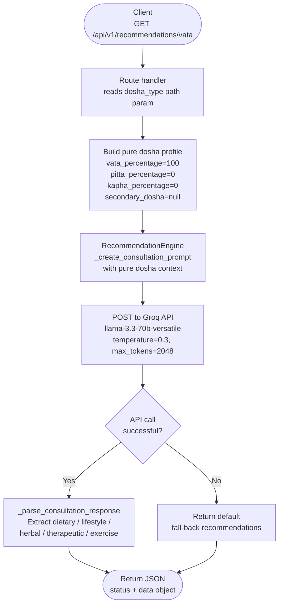

The **Recommendations** endpoint lets you retrieve a full set of Ayurvedic guidance for any one of the three primary doshas — Vata, Pitta, or Kapha — without running a scored quiz. Internally the server constructs a 100% pure dosha profile (for example, `vata_percentage: 100`, all others `0`) and passes it directly to the Groq Llama-3.3-70b model to generate recommendations. This is ideal for educational displays, dosha reference cards, or pre-fetching content before a user completes a full analysis.

## Base URL

| Environment  | Base URL                                             |
|--------------|------------------------------------------------------|
| Production   | `https://dva-mybackend-deployment.onrender.com`      |
| Self-hosted  | `http://localhost:8080`                              |

## Endpoint

```
GET /api/v1/recommendations/{dosha_type}
```

## Request flow



## Path parameter

<ParamField path="dosha_type" type="string" required>
  The Ayurvedic dosha for which you want recommendations. Must be one of:

  | Value    | Meaning                                                        |
  |----------|----------------------------------------------------------------|
  | `vata`   | Air + Ether — associated with movement, creativity, and change |
  | `pitta`  | Fire + Water — associated with transformation and metabolism   |
  | `kapha`  | Earth + Water — associated with structure and stability        |

  The value is **case-sensitive** — send lowercase only.
</ParamField>

<Warning>
  Any value other than `vata`, `pitta`, or `kapha` will result in a `status: "error"` response. The server does not redirect or normalise casing.
</Warning>

## Request examples

<CodeGroup>
```bash cURL — vata
curl https://dva-mybackend-deployment.onrender.com/api/v1/recommendations/vata
```

```bash cURL — pitta
curl https://dva-mybackend-deployment.onrender.com/api/v1/recommendations/pitta
```

```bash cURL — kapha
curl https://dva-mybackend-deployment.onrender.com/api/v1/recommendations/kapha
```

```python Python — vata
import requests

dosha = "vata"
response = requests.get(
    f"https://dva-mybackend-deployment.onrender.com/api/v1/recommendations/{dosha}"
)
data = response.json()
print(data["data"]["dietary"])
```

```javascript JavaScript — pitta
const dosha = "pitta";
const res = await fetch(
  `https://dva-mybackend-deployment.onrender.com/api/v1/recommendations/${dosha}`
);
const json = await res.json();
console.log(json.data.lifestyle);
```
</CodeGroup>

## Response fields

<ResponseField name="status" type="string">
  `"success"` when recommendations were generated, `"error"` otherwise.
</ResponseField>

<ResponseField name="data" type="object">
  Present on success. Contains five recommendation arrays, one per Ayurvedic domain.

  <Expandable title="data fields">
    <ResponseField name="data.dietary" type="array of strings">
      Foods, flavours, preparation methods, and meal-timing guidance to balance the requested dosha. Each item is a standalone, actionable recommendation.
    </ResponseField>

    <ResponseField name="data.lifestyle" type="array of strings">
      Daily routine practices, Dinacharya adjustments, sleep hygiene, and environmental considerations appropriate for the dosha.
    </ResponseField>

    <ResponseField name="data.herbal" type="array of strings">
      Named Ayurvedic herbs or classical formulations with dosage, timing, preparation method, and therapeutic purpose.
    </ResponseField>

    <ResponseField name="data.therapeutic" type="array of strings">
      Classical Ayurvedic treatments and Panchakarma therapies with frequency, duration, and any contraindications to be aware of.
    </ResponseField>

    <ResponseField name="data.exercise" type="array of strings">
      Movement and yoga practices suited to the dosha, including intensity, duration, frequency, and the optimal time of day.
    </ResponseField>
  </Expandable>
</ResponseField>

<ResponseField name="error" type="string | null">
  `null` on success. A descriptive error string when `status` is `"error"`.
</ResponseField>

## Example responses

<CodeGroup>
```json Success — dosha_type=vata (200)
{
  "status": "success",
  "data": {
    "dietary": [
      "Eat warm, freshly cooked meals with healthy fats such as ghee, sesame oil, and avocado to counteract Vata's inherent dryness.",
      "Favour sweet, sour, and salty tastes — they are the three tastes that pacify Vata.",
      "Include nourishing root vegetables (sweet potato, carrot, beet) and well-cooked grains (rice, oats, quinoa) at every meal.",
      "Avoid raw salads, dried foods, crackers, popcorn, and cold or iced beverages.",
      "Drink warm herbal teas (ginger, liquorice, cinnamon) throughout the day to maintain inner warmth and hydration.",
      "Space meals 4–5 hours apart and never skip breakfast — irregular eating strongly aggravates Vata."
    ],
    "lifestyle": [
      "Follow a consistent Dinacharya (daily routine): rise before 6 am, meditate, perform Abhyanga, then eat breakfast at a fixed time.",
      "Minimise multi-tasking and digital over-stimulation; Vata types are prone to scattered attention and mental fatigue.",
      "Create a warm, quiet, and orderly home environment — clutter and noise directly aggravate Vata.",
      "Prioritise 7–9 hours of sleep; go to bed before 10 pm when possible to avoid the Vata night hours (2–6 am).",
      "Protect yourself from wind and cold — wear layers, cover your ears, and avoid prolonged outdoor exposure on cold windy days."
    ],
    "herbal": [
      "Ashwagandha (Withania somnifera): 300–500 mg standardised extract at night with warm milk to calm the nervous system and build Ojas.",
      "Triphala: 1 tsp powder in warm water at bedtime to regulate the bowels — Vata types are prone to constipation.",
      "Shatavari (Asparagus racemosus): 500 mg twice daily with meals to nourish reproductive tissues and counteract dryness.",
      "Bala (Sida cordifolia): 250 mg twice daily to strengthen muscle tissue and support Vata's inherently lighter body type.",
      "Dashamoola tea: 1 cup twice daily — a classical ten-root formula that is deeply pacifying for systemic Vata excess."
    ],
    "therapeutic": [
      "Abhyanga (warm sesame oil self-massage): 15–20 minutes daily before bathing — the single most effective home therapy for Vata.",
      "Basti (medicated enema): the primary Panchakarma treatment for Vata; consult a qualified Ayurvedic physician for a course.",
      "Shirodhara (steady stream of warm oil over the forehead): monthly, 45 minutes per session, to pacify Vata in the nervous system and mind.",
      "Swedana (herbal steam therapy): weekly to open channels, loosen tension, and bring warmth deep into the tissues.",
      "Kati Basti (warm oil pooling on the lower back): beneficial for lower-back pain, a common Vata complaint; 30 minutes per session."
    ],
    "exercise": [
      "Choose slow, deliberate, grounding practices: Hatha yoga (especially forward folds and standing poses), Yin yoga, Tai Chi, and gentle swimming.",
      "Exercise in the morning Kapha window (6–10 am) to build internal heat without over-exciting Vata.",
      "Keep sessions to 30–45 minutes at moderate intensity — Vata types deplete quickly and benefit most from consistency over intensity.",
      "Always warm up slowly and cool down completely; sudden transitions of intensity or temperature worsen Vata.",
      "Avoid high-impact sports, extreme endurance activities, and outdoor exercise in cold or windy conditions."
    ]
  },
  "error": null
}
```

```json Error — invalid dosha_type (200)
{
  "status": "error",
  "data": null,
  "error": "Invalid dosha type: 'tridosha'. Valid values are vata, pitta, kapha."
}
```
</CodeGroup>

<Note>
  Even when the Groq API call fails (for example due to a transient network issue), the server returns HTTP **200** with `status: "success"` and a set of default fallback recommendations rather than an empty response. Your client can treat any non-null `data` as displayable content.
</Note>

<Tip>
  You can use this endpoint to pre-populate a dosha reference library in your frontend cache. Because the pure-dosha profiles are deterministic inputs, the LLM output is highly stable at `temperature: 0.3` — safe to cache for 24 hours without meaningfully stale content.
</Tip>
