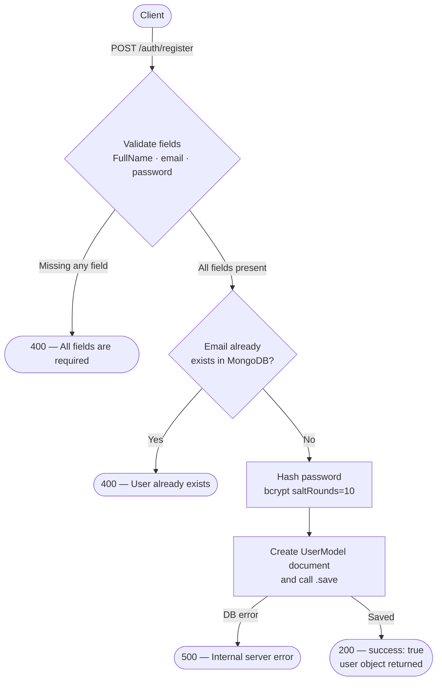

Creating an account on AyurGuide is the first step to accessing personalised Ayurvedic health guidance. You submit your full name, email address, and a plain-text password; the server validates the fields, checks that the email is not already taken, hashes the password with bcrypt, persists the user in MongoDB, and immediately returns the newly created user object. No authentication token is required to call this endpoint.

## Endpoint

| | |
|---|---|
| **Base URL** | `https://dva-mybackend-deployment.onrender.com` |
| **Method** | `POST` |
| **Path** | `/auth/register` |
| **Alias** | `/auth/Register` (identical behaviour) |
| **Authentication** | None |
| **Content-Type** | `application/json` or `multipart/form-data` (when uploading a profile photo) |

---

## Request flow



---

## Request body

<ParamField body="FullName" type="string" required>
  The user's full name as they want it displayed throughout the platform (e.g. `"Ritika Gaur"`).
</ParamField>

<ParamField body="email" type="string" required>
  A valid email address. This value is used as the unique identifier for login and must not already exist in the database.
</ParamField>

<ParamField body="password" type="string" required>
  The user's chosen password in plain text. The server hashes it with **bcrypt** (salt rounds: 10) before storing it — your raw password is never persisted.
</ParamField>

<ParamField body="profile" type="file">
  An optional profile photo sent as part of a `multipart/form-data` request. The field name must be `profile`. When omitted, the user is created without a profile image.
</ParamField>

<Warning>
  Never log or cache the raw `password` value on the client side. Send it over HTTPS only.
</Warning>

---

## Request examples

<CodeGroup>

```json JSON body
{
  "FullName": "Ritika Gaur",
  "email": "ritika@example.com",
  "password": "SecureP@ss123"
}
```

```bash multipart/form-data (cURL)
curl -X POST https://dva-mybackend-deployment.onrender.com/auth/register \
  -F "FullName=Ritika Gaur" \
  -F "email=ritika@example.com" \
  -F "password=SecureP@ss123" \
  -F "profile=@/path/to/photo.jpg"
```

</CodeGroup>

---

## Response fields

<ResponseField name="success" type="boolean">
  `true` when the user was created successfully; `false` on any error.
</ResponseField>

<ResponseField name="message" type="string">
  A human-readable status message, e.g. `"User registered successfully"`.
</ResponseField>

<ResponseField name="user" type="object">
  The full MongoDB document for the newly created user.

  <Expandable title="user object fields">
    <ResponseField name="user._id" type="string">
      MongoDB ObjectId uniquely identifying this user. Store this if you need to reference the user in subsequent API calls.
    </ResponseField>

    <ResponseField name="user.FullName" type="string">
      The full name provided during registration.
    </ResponseField>

    <ResponseField name="user.email" type="string">
      The email address associated with the account.
    </ResponseField>

    <ResponseField name="user.createdAt" type="string (ISO 8601)">
      Timestamp recording when the document was first saved, automatically set by Mongoose's `timestamps` option.
    </ResponseField>

    <ResponseField name="user.updatedAt" type="string (ISO 8601)">
      Timestamp of the most recent update to the document, also managed automatically by Mongoose.
    </ResponseField>
  </Expandable>
</ResponseField>

---

## Response examples

### 200 — Registration successful

```json
{
  "success": true,
  "message": "User registered successfully",
  "user": {
    "_id": "664f1a2b3c4d5e6f7a8b9c0d",
    "FullName": "Ritika Gaur",
    "email": "ritika@example.com",
    "createdAt": "2024-05-23T10:45:00.000Z",
    "updatedAt": "2024-05-23T10:45:00.000Z",
    "__v": 0
  }
}
```

### 400 — Missing required fields

Returned when any one of `FullName`, `email`, or `password` is absent from the request body.

```json
{
  "success": false,
  "message": "All fields (FullName, email, password) are required"
}
```

### 400 — User already exists

Returned when the submitted email address already belongs to an existing account.

```json
{
  "success": false,
  "message": "User already exists, please login"
}
```

### 500 — Server error

Returned when an unexpected database or runtime error occurs.

```json
{
  "success": false,
  "message": "Internal server error"
}
```

---

## Next steps

Once you have successfully registered, use the [Login](/api/auth/login) endpoint to authenticate and receive a JWT that you can include in subsequent requests.

<Note>
  The `password` field returned inside the `user` object is the **bcrypt hash**, not your original password. Your application should discard this value and never display it to users.
</Note>
