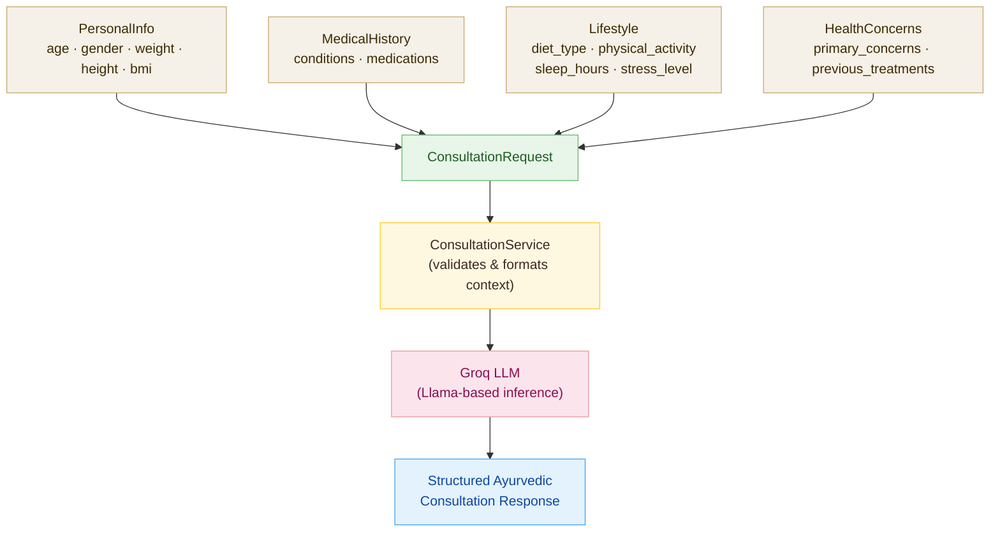

This page documents every Pydantic data model used by the Personal Consultation endpoint in the AyurGuide API. You will find field-level definitions, validation rules, realistic JSON examples, and a data-flow diagram that shows how the nested `ConsultationRequest` body travels through the consultation service and reaches the Groq LLM to produce a structured Ayurvedic response.

---

## PersonalInfo

`PersonalInfo` captures the basic biometric details of the person requesting a consultation. These values inform the Ayurvedic analysis — age, gender, and body composition all influence which recommendations are appropriate.

```json
{
  "age": 32,
  "gender": "female",
  "weight": 62.5,
  "height": 165.0,
  "bmi": 22.96
}
```

<ResponseField name="age" type="integer" required>
  The person's age in whole years. Must be between `1` and `120` (inclusive). Values outside this range are rejected with a `422 Unprocessable Entity` error.
</ResponseField>

<ResponseField name="gender" type="string" required>
  The person's gender. Accepted values (case-insensitive) are `"male"`, `"female"`, and `"other"`. The API normalises the value to lowercase before processing, so `"Female"` and `"FEMALE"` are both accepted and stored as `"female"`.
</ResponseField>

<ResponseField name="weight" type="float" required>
  Body weight in **kilograms**. Must be between `20` and `200` kg inclusive.
</ResponseField>

<ResponseField name="height" type="float" required>
  Height in **centimetres**. Must be between `100` and `250` cm inclusive.
</ResponseField>

<ResponseField name="bmi" type="float" required>
  Body Mass Index, calculated as `weight / (height / 100)²`. You are responsible for computing and passing this value — the API does not derive it server-side. For example, a person weighing 62.5 kg at 165 cm has a BMI of `62.5 / (1.65)² ≈ 22.96`.
</ResponseField>

<Note>
The BMI field is **not validated** against the weight and height fields — the API accepts whatever float you supply. Compute it accurately on your client using the formula `weight_kg / (height_m ** 2)` to ensure the consultation analysis is meaningful.
</Note>

<Warning>
`gender` is validated with a Pydantic `@validator`. Sending any value other than `"male"`, `"female"`, or `"other"` (including an empty string) raises a `ValueError` and returns a `422` response with a descriptive message.
</Warning>

---

## MedicalHistory

`MedicalHistory` records any pre-existing health conditions and current medications. The consultation service uses this context to tailor Ayurvedic recommendations and flag contraindications.

```json
{
  "conditions": ["Diabetes", "Sleep Disorders"],
  "medications": "Metformin 500 mg twice daily"
}
```

<ResponseField name="conditions" type="string[]">
  A list of pre-existing health conditions. Defaults to an empty list `[]` when omitted. Use `["None"]` explicitly to signal that the person has no known conditions. The following condition names are recognised and produce the most targeted recommendations:

  - `"Diabetes"`
  - `"Hypertension"`
  - `"Arthritis"`
  - `"Digestive Issues"`
  - `"Respiratory Problems"`
  - `"Skin Conditions"`
  - `"Sleep Disorders"`
  - `"Stress/Anxiety"`

  You may include condition strings outside this list — they will be forwarded to the LLM without special handling.
</ResponseField>

<ResponseField name="medications" type="string | null">
  A free-text description of any current medications, including dosage where known. Pass `null` or omit the field entirely if the person is not taking any medications.
</ResponseField>

<Note>
When the person has no conditions, prefer sending `["None"]` rather than an empty array. This signals explicit intent to the LLM and prevents it from treating missing data as unknown.
</Note>

---

## Lifestyle

`Lifestyle` describes the person's everyday habits. Diet, activity, sleep, and stress patterns are primary Ayurvedic diagnostic signals and heavily influence the consultation output.

```json
{
  "diet_type": "vegetarian",
  "physical_activity": "moderate",
  "sleep_hours": 7,
  "stress_level": "medium"
}
```

<ResponseField name="diet_type" type="string" required>
  The person's dietary pattern. Common accepted values include `"vegetarian"`, `"vegan"`, `"omnivore"`, and `"pescatarian"`. The field is free-form text, so you may pass other descriptive values — they are forwarded as-is to the consultation service.
</ResponseField>

<ResponseField name="physical_activity" type="string" required>
  The person's typical activity level. Recommended values are `"sedentary"`, `"light"`, `"moderate"`, and `"active"`. Like `diet_type`, this field accepts any string, but using the canonical values yields the most consistent recommendations.
</ResponseField>

<ResponseField name="sleep_hours" type="integer" required>
  Average hours of sleep per night, as a whole number. Must be between `4` and `12` inclusive.
</ResponseField>

<ResponseField name="stress_level" type="string" required>
  The person's self-reported stress level. **This field is strictly validated.** Accepted values (case-insensitive) are `"low"`, `"medium"`, and `"high"`. The API normalises to lowercase before processing.
</ResponseField>

<Warning>
`stress_level` is enforced by a Pydantic `@validator`. Any value other than `"low"`, `"medium"`, or `"high"` will cause the entire request to fail with a `422 Unprocessable Entity` error and the message: *"Stress level must be one of: low, medium, high"*.
</Warning>

---

## HealthConcerns

`HealthConcerns` captures the primary reason the person is seeking an Ayurvedic consultation, along with any relevant treatment history. This is the most open-ended section — it is passed directly to the Groq LLM as contextual input.

```json
{
  "primary_concerns": "Persistent fatigue, poor digestion, and difficulty concentrating for the past three months.",
  "previous_treatments": "Tried Ashwagandha supplements for six weeks with partial improvement in energy levels."
}
```

<ResponseField name="primary_concerns" type="string" required>
  A plain-text description of the person's main health concerns. Write this in natural language — the more specific the description, the more targeted the consultation response. There is no enforced length limit, but concise, focused descriptions (one to three sentences) produce the best results.
</ResponseField>

<ResponseField name="previous_treatments" type="string | null">
  A description of any Ayurvedic or conventional treatments previously attempted, and their outcomes. Pass `null` or omit the field if no prior treatments are relevant.
</ResponseField>

---

## ConsultationRequest

`ConsultationRequest` is the top-level object you send to `POST /personal-consultation`. It composes all four models above into a single request body.

```json
{
  "personal_info": {
    "age": 32,
    "gender": "female",
    "weight": 62.5,
    "height": 165.0,
    "bmi": 22.96
  },
  "medical_history": {
    "conditions": ["Digestive Issues", "Stress/Anxiety"],
    "medications": null
  },
  "lifestyle": {
    "diet_type": "vegetarian",
    "physical_activity": "light",
    "sleep_hours": 6,
    "stress_level": "high"
  },
  "concerns": {
    "primary_concerns": "Bloating after meals, irregular bowel movements, and low energy throughout the day.",
    "previous_treatments": "Tried probiotics for one month; some improvement in bloating but energy levels unchanged."
  }
}
```

<ResponseField name="personal_info" type="PersonalInfo" required>
  Biometric details for the person requesting the consultation.

  <Expandable title="PersonalInfo fields">
    <ResponseField name="age" type="integer" required>
      Age in whole years. Range: `1 – 120`.
    </ResponseField>
    <ResponseField name="gender" type="string" required>
      One of `"male"`, `"female"`, or `"other"` (case-insensitive).
    </ResponseField>
    <ResponseField name="weight" type="float" required>
      Body weight in kilograms. Range: `20 – 200`.
    </ResponseField>
    <ResponseField name="height" type="float" required>
      Height in centimetres. Range: `100 – 250`.
    </ResponseField>
    <ResponseField name="bmi" type="float" required>
      BMI computed as `weight / (height / 100)²`. You must calculate and supply this value.
    </ResponseField>
  </Expandable>
</ResponseField>

<ResponseField name="medical_history" type="MedicalHistory" required>
  Pre-existing conditions and current medications.

  <Expandable title="MedicalHistory fields">
    <ResponseField name="conditions" type="string[]">
      List of condition names. Defaults to `[]`. Use `["None"]` for no conditions.
    </ResponseField>
    <ResponseField name="medications" type="string | null">
      Free-text description of current medications, or `null`.
    </ResponseField>
  </Expandable>
</ResponseField>

<ResponseField name="lifestyle" type="Lifestyle" required>
  Everyday habits including diet, activity, sleep, and stress.

  <Expandable title="Lifestyle fields">
    <ResponseField name="diet_type" type="string" required>
      Dietary pattern, e.g. `"vegetarian"`, `"vegan"`, `"omnivore"`.
    </ResponseField>
    <ResponseField name="physical_activity" type="string" required>
      Activity level, e.g. `"sedentary"`, `"light"`, `"moderate"`, `"active"`.
    </ResponseField>
    <ResponseField name="sleep_hours" type="integer" required>
      Average nightly sleep in whole hours. Range: `4 – 12`.
    </ResponseField>
    <ResponseField name="stress_level" type="string" required>
      Strictly one of `"low"`, `"medium"`, or `"high"` (case-insensitive).
    </ResponseField>
  </Expandable>
</ResponseField>

<ResponseField name="concerns" type="HealthConcerns" required>
  Primary health concerns and treatment history.

  <Expandable title="HealthConcerns fields">
    <ResponseField name="primary_concerns" type="string" required>
      Natural-language description of the person's main health concerns.
    </ResponseField>
    <ResponseField name="previous_treatments" type="string | null">
      Description of prior treatments and outcomes, or `null`.
    </ResponseField>
  </Expandable>
</ResponseField>

---

## Data Flow Diagram

The diagram below illustrates how a `ConsultationRequest` is composed, processed, and resolved into a structured Ayurvedic consultation response.



---

## Validation Summary

The table below consolidates every enforced constraint across all five models so you can validate inputs client-side before sending the request.

| Model | Field | Type | Constraint |
|-------|-------|------|------------|
| `PersonalInfo` | `age` | `int` | `1 – 120` |
| `PersonalInfo` | `gender` | `str` | `"male"` \| `"female"` \| `"other"` |
| `PersonalInfo` | `weight` | `float` | `20 – 200 kg` |
| `PersonalInfo` | `height` | `float` | `100 – 250 cm` |
| `Lifestyle` | `sleep_hours` | `int` | `4 – 12` |
| `Lifestyle` | `stress_level` | `str` | `"low"` \| `"medium"` \| `"high"` |
