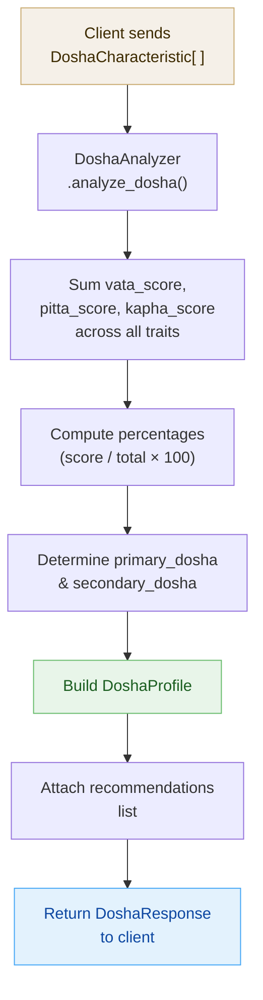

This page documents every Pydantic data model used by the Dosha Analysis endpoints in the AyurGuide API. You will find field-level definitions, validation constraints, canonical JSON examples, and a data-flow diagram that traces how a list of `DoshaCharacteristic` inputs is transformed into a `DoshaResponse` that your client receives.

---

## DoshaType Enum

Before diving into the request and response models, it is useful to understand the three dosha types the API recognises. Every `primary_dosha` and `secondary_dosha` value in any response will be one of these strings.

| Enum member | String value |
|-------------|--------------|
| `DoshaType.VATA`  | `"vata"`  |
| `DoshaType.PITTA` | `"pitta"` |
| `DoshaType.KAPHA` | `"kapha"` |

<Note>
All dosha type values are returned in **lowercase**. When you compare or display them, treat `"vata"`, `"pitta"`, and `"kapha"` as the canonical forms.
</Note>

---

## DoshaCharacteristic

`DoshaCharacteristic` represents a single observable physical or behavioural trait. You send an **array** of these objects inside the `/analyze-dosha` request body. Each object captures how strongly that trait aligns with each of the three doshas on a non-negative integer scale.

```json
{
  "trait_name": "body_frame",
  "vata_score": 3,
  "pitta_score": 1,
  "kapha_score": 0
}
```

<ResponseField name="trait_name" type="string" required>
  A short identifier for the physical or behavioural characteristic being scored (for example `"body_frame"`, `"digestion"`, `"skin_type"`). The value is free-form text; use consistent naming across all traits in a single request.
</ResponseField>

<ResponseField name="vata_score" type="integer" required>
  How strongly this trait aligns with the **Vata** dosha. Must be `0` or greater — negative values are rejected with a `422 Unprocessable Entity` error.
</ResponseField>

<ResponseField name="pitta_score" type="integer" required>
  How strongly this trait aligns with the **Pitta** dosha. Must be `0` or greater.
</ResponseField>

<ResponseField name="kapha_score" type="integer" required>
  How strongly this trait aligns with the **Kapha** dosha. Must be `0` or greater.
</ResponseField>

<Warning>
All three score fields enforce `ge=0`. Sending any negative integer will cause the request to fail validation before it reaches the analysis logic.
</Warning>

---

## DoshaProfile

`DoshaProfile` is the internal computed result of the dosha analysis. It expresses each dosha as a **percentage of the total score** so that the three values always sum to `100`. You will encounter this shape as the basis for the final `DoshaResponse` returned to your client.

```json
{
  "primary_dosha": "vata",
  "secondary_dosha": "pitta",
  "vata_percentage": 60.0,
  "pitta_percentage": 25.0,
  "kapha_percentage": 15.0
}
```

<ResponseField name="primary_dosha" type="string" required>
  The dominant dosha determined by the highest cumulative score across all submitted traits. Always one of `"vata"`, `"pitta"`, or `"kapha"`.
</ResponseField>

<ResponseField name="secondary_dosha" type="string | null">
  The second-highest dosha, present when it is meaningfully elevated. Returns `null` when the primary dosha is overwhelming and no secondary influence is significant.
</ResponseField>

<ResponseField name="vata_percentage" type="float" required>
  Vata's share of the total dosha score, expressed as a percentage between `0.0` and `100.0` (inclusive). Enforced by `ge=0, le=100`.
</ResponseField>

<ResponseField name="pitta_percentage" type="float" required>
  Pitta's share of the total score, between `0.0` and `100.0`.
</ResponseField>

<ResponseField name="kapha_percentage" type="float" required>
  Kapha's share of the total score, between `0.0` and `100.0`.
</ResponseField>

<Note>
The three percentage fields are mathematically guaranteed to sum to `100.0`. If you display them in a pie or donut chart, no rounding adjustment is needed.
</Note>

---

## DoshaResponse

`DoshaResponse` is the top-level object your client receives from `POST /analyze-dosha`. It extends `DoshaProfile` with a `recommendations` list — a set of personalised Ayurvedic lifestyle and dietary suggestions derived from the computed dosha balance.

```json
{
  "primary_dosha": "vata",
  "secondary_dosha": "pitta",
  "vata_percentage": 60.0,
  "pitta_percentage": 25.0,
  "kapha_percentage": 15.0,
  "recommendations": [
    "Incorporate grounding foods like root vegetables.",
    "Avoid cold and raw foods; prefer warm, cooked meals.",
    "Practice yoga or meditation to calm the mind."
  ]
}
```

<ResponseField name="primary_dosha" type="string" required>
  The dominant dosha. Matches the value in the underlying `DoshaProfile`.
</ResponseField>

<ResponseField name="secondary_dosha" type="string | null">
  The secondary dosha influence, or `null` if absent.
</ResponseField>

<ResponseField name="vata_percentage" type="float" required>
  Vata's percentage of the total dosha score.
</ResponseField>

<ResponseField name="pitta_percentage" type="float" required>
  Pitta's percentage of the total dosha score.
</ResponseField>

<ResponseField name="kapha_percentage" type="float" required>
  Kapha's percentage of the total dosha score.
</ResponseField>

<ResponseField name="recommendations" type="string[]" required>
  An ordered list of personalised Ayurvedic recommendations generated from the dosha balance. Each element is a plain-text sentence. The list will contain at least one item; its length varies depending on the computed profile.
</ResponseField>

---

## Data Flow Diagram

The diagram below shows how your array of `DoshaCharacteristic` objects moves through the analysis pipeline and is shaped into the final `DoshaResponse`.



---

## Validation Summary

The table below consolidates every field-level constraint across all three models so you can validate inputs on the client side before sending a request.

| Model | Field | Type | Constraint |
|-------|-------|------|------------|
| `DoshaCharacteristic` | `vata_score` | `int` | `>= 0` |
| `DoshaCharacteristic` | `pitta_score` | `int` | `>= 0` |
| `DoshaCharacteristic` | `kapha_score` | `int` | `>= 0` |
| `DoshaProfile` | `vata_percentage` | `float` | `0 – 100` |
| `DoshaProfile` | `pitta_percentage` | `float` | `0 – 100` |
| `DoshaProfile` | `kapha_percentage` | `float` | `0 – 100` |
| `DoshaResponse` | `recommendations` | `string[]` | at least one item |
