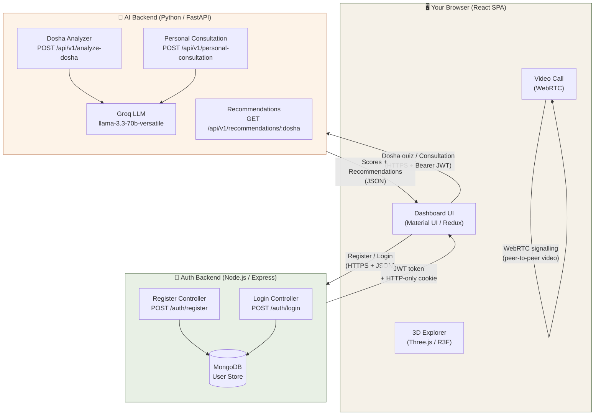
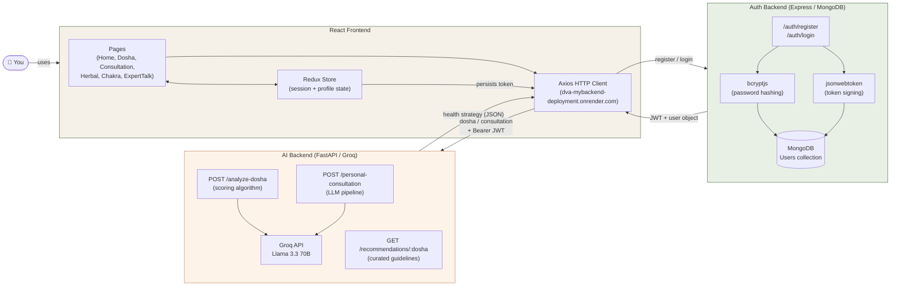
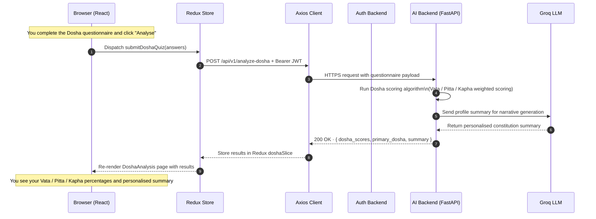

Understanding how Mydva is built helps you make the most of it. Every feature you interact with — the Dosha quiz, the AI consultation, the 3D explorer, the video calls — is served by a purpose-built tier of the platform. This page explains what each tier does *for you*, how your data flows through the system, and why the architecture is designed the way it is.

## Three-Tier Overview

Mydva is structured as three cooperating services, each with a distinct responsibility:

| Tier | Technology | What it enables for you |
|---|---|---|
| **Presentation** | React 18, Material UI, Three.js / React Three Fiber, Redux Toolkit | The browser app you see and touch — dashboards, 3D visualisations, forms, and navigation |
| **Authentication** | Node.js, Express.js, MongoDB, JWT, Bcrypt.js | Secure account creation, login, and session management so your data stays private |
| **Intelligence** | Python, FastAPI, Groq Llama 3.3 (70B), Pydantic v2 | The AI engine that analyses your constitution and generates personalised health recommendations |

The complete system looks like this:

<Note>
Your browser communicates with **both** the Auth Backend and the AI Backend directly over HTTPS. The Auth Backend is responsible solely for identity; it never sees your health data. The AI Backend never stores your password — it only receives your anonymised health inputs alongside a valid JWT.
</Note>

## Complete System: How All Tiers Connect

## Request Lifecycle: Dosha Analysis End-to-End

The sequence below traces exactly what happens from the moment you press **Analyse** on the Dosha quiz form to the moment your Vata / Pitta / Kapha percentages appear on screen.

<Tip>
The JWT token you received at login is included automatically by the Axios client on every AI request. You never need to manually attach it inside the dashboard — the platform manages this on your behalf.
</Tip>

## Technology Stack

### Presentation Tier — Your Browser

| Library / Tool | Role |
|---|---|
| React 18 (Create React App) | Component-based single-page application framework |
| Material UI (MUI v5) | Accessible, responsive UI components and theming |
| Redux Toolkit + React-Redux | Global state management (session, Dosha profile, consultation results) |
| Three.js / React Three Fiber / Drei | 3D rendering of medicinal herbs and chakra energy systems in the browser |
| React Router v6 | Client-side routing and protected route guards |
| Axios | HTTP client for all API calls, with request/response interceptors |
| Socket.io-client / WebRTC | Real-time signalling and peer-to-peer video for expert consultations |

### Authentication Tier

| Library / Tool | Role |
|---|---|
| Node.js (ES Modules) | Server runtime |
| Express.js | Lightweight HTTP framework; defines `/auth/register` and `/auth/login` routes |
| MongoDB + Mongoose | Persistent user storage with schema validation |
| bcryptjs | Salted password hashing (10 rounds) before any data reaches the database |
| jsonwebtoken | Signs JWTs bound to your `userId`; tokens are valid for 3 days |
| Cookie Parser | Parses the HTTP-only `token` cookie on incoming requests |
| Multer | Optional profile photo upload handling on registration |

### Intelligence Tier

| Library / Tool | Role |
|---|---|
| Python 3.9+ | Server runtime |
| FastAPI | High-performance async web framework with automatic OpenAPI docs at `/docs` |
| Uvicorn | ASGI server runner |
| Groq API (`llama-3.3-70b-versatile`) | LLM inference for personalised consultation narrative generation |
| Pydantic v2 | Request/response schema validation and serialisation |

## What Each Tier Enables for You

### The Presentation Tier: Your Interactive Wellness Environment

The React frontend is where your entire Mydva experience lives. It provides:

- **A personalised dashboard** that surfaces your current Dosha profile, today's wellness tips, and quick links to every feature the moment you log in.
- **The Dosha quiz form** — a multi-step questionnaire that collects your physical and lifestyle characteristics and submits them to the AI backend with a single click.
- **The 3D Herbal Remedies Explorer** — a React Three Fiber scene where you rotate, zoom, and inspect medicinal plants. Each plant card displays botanical name, active constituents, doshic impact, and preparation methods.
- **The 3D Chakra System** — an immersive WebGL environment covering all seven chakra energy centres, complete with guided meditation audio, mantra players, mudra visualisers, and breathing rhythm guides.
- **The Expert Talk module** — a slot-booking interface that connects you with verified Ayurvedic doctors and launches a live WebRTC video session without leaving the browser tab.
- **The Wellness Centre Finder** — a geolocation-powered directory of nearby Ayurvedic clinics and Panchakarma centres.
- **The Education Hub** — a structured library of articles, videos, and guides covering Ayurvedic philosophy, nutrition, and daily practice.

### The Authentication Tier: Your Privacy Guarantee

The Auth Backend handles every aspect of identity so that your health data stays secure:

- **Account registration** — your password is hashed with bcrypt before being stored; the plain-text value is discarded immediately after hashing.
- **Session tokens** — after a successful login you receive a signed JWT (valid for 72 hours) delivered both in the response body and as an HTTP-only cookie. HTTP-only cookies are inaccessible to JavaScript, protecting you against cross-site scripting attacks.
- **Route protection** — the frontend's `ProtectedRoute` component checks for a valid token before rendering any dashboard page. If your session has expired you are redirected to login rather than seeing an error.

### The Intelligence Tier: Your Personalised Health Advisor

The FastAPI AI Backend is where Ayurvedic science meets large language model reasoning:

- **Dosha scoring** — a deterministic algorithm processes your questionnaire answers across physiological, digestive, sleep, and mental dimensions and returns precise Vata / Pitta / Kapha percentage breakdowns. This gives you an objective baseline rather than a vague archetype label.
- **AI consultation** — the Groq Llama 3.3 (70B) model receives your Dosha profile, medical history, current symptoms, and lifestyle data and generates a structured Ayurvedic health strategy: foods to favour and reduce, specific herbs with explanations, and a morning-to-evening daily routine template.
- **Dosha recommendations** — the `GET /recommendations/:dosha_type` endpoint delivers curated, static lifestyle and dietary guidelines for your primary constitution — useful for quick reference without running a full consultation.
- **High-performance async API** — FastAPI's async architecture ensures that even during complex LLM inference the server remains responsive, and the auto-generated Swagger docs at `/docs` let developers inspect every endpoint schema.

<Warning>
Mydva's AI-generated consultations are for informational and wellness purposes only. They are not a substitute for professional medical diagnosis or treatment. Always consult a qualified healthcare provider for medical concerns. Use the **Expert Talk** feature to speak directly with a certified Ayurvedic practitioner.
</Warning>

## Next Steps

<CardGroup cols={2}>
  <Card title="Quick Start" icon="rocket" href="/quickstart">
    Register, get your JWT, and run your first Dosha analysis with real cURL examples.
  </Card>
  <Card title="Introduction" icon="book-open" href="/introduction">
    Learn about Mydva's three pillars and who the platform is designed for.
  </Card>
  <Card title="Auth API Reference" icon="key" href="/api/auth/register">
    Detailed reference for the `/auth/register` and `/auth/login` endpoints.
  </Card>
  <Card title="Understanding Doshas" icon="leaf" href="/concepts/doshas">
    Deepen your knowledge of Vata, Pitta, and Kapha before taking the quiz.
  </Card>
</CardGroup>
