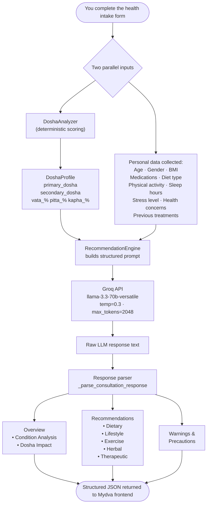

When you submit a consultation request in Mydva, two distinct systems work in concert to produce your personalised Ayurvedic guidance. The first is a rule-based scoring algorithm that calculates your precise dosha profile from your quiz answers — fast, deterministic, and entirely transparent. The second is a large language model — Groq's Llama 3.3-70B — that receives your full health profile and produces rich, detailed, human-readable recommendations across seven clinical domains. Together, these two systems bridge the structured knowledge of classical Ayurveda with the expressive power of modern AI, giving you guidance that is both grounded in your personal data and articulated with the nuance that health guidance requires.

---

## The Two AI Pathways

### Pathway 1: Dosha Analysis Scoring Algorithm (Deterministic)

The first pathway is Mydva's `DoshaAnalyzer` — a deterministic Python service that converts your quiz answers into a precise dosha profile. There is no probabilistic inference here: your answers map directly to numeric scores, those scores are summed and converted to percentages, and the resulting `DoshaProfile` is always reproducible from the same set of answers.

This pathway runs before the language model is ever involved. It produces the structured `DoshaProfile` — primary dosha, secondary dosha, and exact Vata/Pitta/Kapha percentages — that becomes one of the key inputs to the AI consultation stage.

### Pathway 2: Groq Llama 3.3-70B for Personalised Consultation Text

The second pathway is Mydva's `RecommendationEngine`, which calls the Groq API with the `llama-3.3-70b-versatile` model. This model receives a carefully structured prompt that contains your complete health profile and is instructed to respond as an experienced Ayurvedic practitioner. It generates nuanced, personalised text across all seven recommendation sections, which the engine then parses and returns as structured JSON.

The model is called with a temperature of `0.3` — deliberately low, to favour factual, consistent, clinically-grounded outputs over creative variation. The maximum response length is set to `2,048` tokens to ensure comprehensive coverage of all seven sections.

---

## The AI Pipeline: From Your Data to Your Recommendations

---

## What the AI Considers

The prompt that Mydva sends to Llama 3.3-70B is built from every piece of health data you have provided. Nothing is discarded or summarised away — the model receives the full picture:

### Your Dosha Profile
Your primary and secondary doshas, plus the exact Vata, Pitta, and Kapha percentages, are included verbatim in the prompt. This means the model knows not just that you are "Vata-dominant" but that your Vata is 58%, Pitta is 27%, and Kapha is 15% — allowing it to tailor advice with far greater precision than a category label alone.

### Personal Information
Your age, gender, weight, height, and calculated BMI are included. These are relevant to dosage guidance for herbs, appropriate exercise intensity, and dietary portion considerations.

### Medical History and Ayurvedic Context
Any medical conditions you have reported are passed to the model alongside their classical Ayurvedic interpretation. For example, if you report diabetes, the prompt notes that in Ayurveda this is understood as Prameha — primarily a Kapha disorder with possible Pitta involvement, characterised by impaired metabolism and tissue nutrition. If you report arthritis, the prompt frames this as Sandhivata — a Vata disorder affecting the joints with potential Ama accumulation. This contextualisation ensures the model's recommendations are grounded in Ayurvedic theory, not just general wellness advice.

### Current Medications
Any medications you are taking are included so that the model can identify potential herb-drug interactions in its Warnings & Precautions section.

### Lifestyle Factors
Your diet type, physical activity level, sleep hours per night, and stress level are all passed to the model. These are used to assess the likely state of your Agni (digestive fire), your current dosha aggravation pattern, and the realism of lifestyle recommendations.

### Primary Health Concerns and Previous Treatments
What brought you to Mydva, and what you have already tried, are included to ensure the recommendations are relevant, non-redundant, and appropriate to your specific situation.

---

## The Seven Output Sections

Every Mydva consultation response is parsed into seven distinct, structured sections. The response parser (`_parse_consultation_response`) reads the model's output line by line, identifies section headers, and routes each bullet point to the correct domain.

### 1. Dosha Impact
An explanation of how your current dosha state — your Vikriti — is affecting your health right now. This includes specific dosha-related symptoms to monitor and the dosha-balancing priorities the practitioner recommends focusing on first.

### 2. Dietary Recommendations
Specific foods to include and avoid, along with the best times and methods of consumption, quantity guidelines where applicable, and any special preparations or food combinations relevant to your dosha profile and health conditions.

### 3. Lifestyle Modifications
Concrete daily routine adjustments (Dinacharya) including the best times for activities, recommended durations and frequencies, and practical implementation advice suited to your actual lifestyle data.

### 4. Exercise Recommendations
Specific types of physical activity, intensity levels, session duration and frequency, the best time of day to practise, and any precautions or modifications based on your constitution, conditions, or current medications.

### 5. Herbal Remedies
Named Ayurvedic herbs or classical formulations with specific dosage instructions, method of preparation (e.g., decoction, powder, medicated ghee), recommended duration of use, the precise benefits expected, and any herb-drug interactions to be aware of.

### 6. Therapeutic Treatments
Classical Ayurvedic therapies (e.g., Abhyanga, Shirodhara, Nasya, Basti) matched to your profile, with guidance on frequency, expected outcomes, preparatory requirements, and precautions.

### 7. Warnings and Precautions
A dedicated section listing specific contraindications, interactions with any medications you are taking, warning signs to watch for, and clear instructions on when to seek additional or urgent medical help.

---

## Condition-Aware Recommendations

Mydva maintains a built-in Ayurvedic context library for common medical conditions. When you report any of the following, the model receives both the condition name and its classical Ayurvedic framing:

| Condition | Ayurvedic Context |
|-----------|-------------------|
| Diabetes | Prameha — primarily a Kapha disorder with possible Pitta involvement; impaired metabolism and tissue nutrition |
| Hypertension | Rakta Gata Vata — related to Vata and Pitta imbalances affecting blood circulation and heart function |
| Arthritis | Sandhivata — a Vata disorder affecting joints, with potential Ama (toxin) accumulation |
| Digestive Issues | Involves all three doshas; symptoms indicate the primary dosha imbalance and the state of Agni |
| Respiratory Problems | Primarily Kapha dosha, with possible Vata and Pitta complications affecting Pranavaha Srotas |
| Skin Conditions | Kushtha — can involve all three doshas, but often has a strong Pitta component |
| Sleep Disorders | Primarily Vata imbalance, though other doshas may be involved |
| Stress / Anxiety | Primarily affects Vata dosha, leading to mental and physical imbalances in the body-mind complex |

---

## Fallback and Reliability

If the Groq API is unavailable or returns an error, Mydva's `RecommendationEngine` automatically returns a set of default recommendations that direct you to consult a qualified Ayurvedic practitioner. You will never see a blank or broken consultation response.

<Note>
The low temperature setting of `0.3` is intentional. At this level, Llama 3.3-70B produces responses that are highly consistent, factual, and grounded in the input data — prioritising accurate, actionable health guidance over stylistic variation. Each consultation re-run on the same data will produce substantially similar, comparable recommendations.
</Note>

<Warning>
Mydva's AI engine provides Ayurvedic wellness guidance based on classical principles and your self-reported health data. It is not a licensed medical device, and the output does not constitute a medical diagnosis or prescription. Always consult a qualified healthcare professional — including a licensed Ayurvedic physician — before starting any new supplement, herbal remedy, or treatment regimen, especially if you are pregnant, nursing, managing a chronic condition, or taking prescription medications. If you experience a medical emergency, contact your local emergency services immediately.
</Warning>
