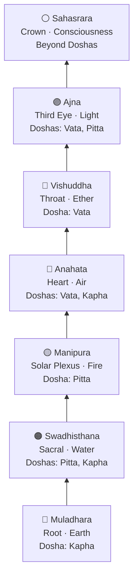

In Ayurveda and its sister science of Yoga, chakras are subtle energy centers (Prana Vayu) located along the central axis of the body. The word "chakra" means "wheel" in Sanskrit, reflecting the spinning, vortex-like nature of these energy fields. Each chakra governs a distinct set of physical organs, emotional states, and energetic qualities, and each one has a corresponding relationship with the three doshas. When a chakra is balanced, the life force (Prana) flows freely through it, supporting the physical and emotional functions it oversees. When a chakra is blocked or over-activated, the related Ayurvedic functions and emotional patterns are disrupted. Mydva's interactive 3D Chakra Explorer allows you to visualise, explore, and work with each of the seven energy centers through a range of evidence-aligned healing practices.

## The Seven Chakras

<AccordionGroup>

<Accordion title="1 · Muladhara — Root Chakra">

**Position:** Base of spine  
**Element:** Earth  
**Mantra:** LAM  
**Frequency:** 396 Hz  
**Associated Doshas:** Kapha  
**Dosha Influence:** Provides stability and grounding energy, supporting Kapha's earth-like qualities.

Muladhara forms the energetic foundation of the entire chakra system. It connects you to the earth, to your physical body, and to your most basic sense of safety and belonging. When this chakra is open and balanced, you feel secure, grounded, and at home in your body.

**Physical Aspects**
Skeletal structure · Legs and feet · Large intestine · Adrenal glands · Blood · Base of the spine

**Emotional Aspects**
Security and safety · Basic survival needs · Grounding · Trust in the world · Self-preservation · Family and tribal connections

**Healing Practices in Mydva**
Walking barefoot in nature · Root chakra meditation · Mountain Pose (Tadasana) · Working with red crystals (Ruby, Garnet, Hematite) · Grounding exercises · Drumming meditation

**Balancing Foods**
Root vegetables · Red foods · Protein-rich foods · Black pepper and ginger · Nuts and seeds

</Accordion>

<Accordion title="2 · Swadhisthana — Sacral Chakra">

**Position:** Lower abdomen  
**Element:** Water  
**Mantra:** VAM  
**Frequency:** 417 Hz  
**Associated Doshas:** Pitta, Kapha  
**Dosha Influence:** Balances emotional fluidity and creative expression, harmonising water elements across Pitta and Kapha.

Swadhisthana governs creativity, sensuality, emotion, and the capacity to experience pleasure. It holds the quality of flow — the ability to move with life's currents rather than resist them. A balanced sacral chakra expresses itself as creative vitality, healthy relationships, and emotional resilience.

**Physical Aspects**
Reproductive system · Lower back · Hips · Sacrum · Bladder · Water retention and fluid balance

**Emotional Aspects**
Creativity · Passion · Sensuality · Emotional balance · Pleasure · Intimate relationships

**Healing Practices in Mydva**
Dance movement · Hip-opening yoga poses · Creative expression · Water meditation · Moon bathing · Artistic activities

**Balancing Foods**
Orange fruits · Sweet foods · Water-rich foods · Cinnamon and vanilla · Tropical fruits · Honey

</Accordion>

<Accordion title="3 · Manipura — Solar Plexus Chakra">

**Position:** Upper abdomen  
**Element:** Fire  
**Mantra:** RAM  
**Frequency:** 528 Hz  
**Associated Doshas:** Pitta  
**Dosha Influence:** Enhances transformation and metabolism, directly strengthening Pitta's fire element and digestive power (Agni).

Manipura is the seat of personal power, self-esteem, and willpower. It is the fire that drives ambition, confidence, and the ability to act decisively in the world. In Ayurvedic terms, this is the home of Agni — the digestive and metabolic fire — making it one of the most clinically significant chakras for physical health.

**Physical Aspects**
Digestive system · Pancreas · Liver · Gallbladder · Metabolism · Core muscles

**Emotional Aspects**
Personal power · Self-confidence · Self-esteem · Willpower · Motivation · Sense of achievement

**Healing Practices in Mydva**
Core-strengthening exercises · Sun salutations · Power yoga · Fire breathing (Kapalabhati) · Martial arts · Solar meditation

**Balancing Foods**
Yellow foods · Whole grains · Turmeric and ginger · Citrus fruits · Complex carbohydrates · Bananas

</Accordion>

<Accordion title="4 · Anahata — Heart Chakra">

**Position:** Centre of chest  
**Element:** Air  
**Mantra:** YAM  
**Frequency:** 639 Hz  
**Associated Doshas:** Vata, Kapha  
**Dosha Influence:** Promotes balance between movement and stability, harmonising the air element (Vata) and the nurturing, structural quality of Kapha.

Anahata is the bridge between the lower, earth-bound chakras and the upper, spirit-oriented chakras. It is the center of unconditional love, compassion, and deep human connection. In Ayurveda, a balanced heart center is considered essential for Ojas — the refined essence of vitality and immunity.

**Physical Aspects**
Heart · Lungs · Chest · Arms and hands · Thymus gland

**Emotional Aspects**
Love · Compassion · Forgiveness · Empathy · Self-love · Relationship depth

**Healing Practices in Mydva**
Heart-opening yoga poses · Loving-kindness (Metta) meditation · Deep breathing exercises · Forgiveness practices · Gratitude journaling · Service to others (Seva)

**Balancing Foods**
Green vegetables · Green tea · Air-cleaning herbs · Leafy greens · Sprouts · Green apples

</Accordion>

<Accordion title="5 · Vishuddha — Throat Chakra">

**Position:** Throat  
**Element:** Ether / Space  
**Mantra:** HAM  
**Frequency:** 741 Hz  
**Associated Doshas:** Vata  
**Dosha Influence:** Enhances clear communication and authentic self-expression, supporting Vata's ether element and the channels of Prana through sound.

Vishuddha governs all forms of communication — spoken, written, and creative. It is the energy center of truth-speaking, authentic self-expression, and the ability to listen as deeply as you speak. In Ayurveda, the throat is a vital gateway for Prana, and a balanced Vishuddha ensures that energy flows freely between the body and the mind.

**Physical Aspects**
Throat · Thyroid and parathyroid glands · Neck · Mouth · Ears · Voice

**Emotional Aspects**
Communication · Self-expression · Truth-speaking · Creativity through voice · Active listening · Personal integrity

**Healing Practices in Mydva**
Chanting (Mantras) · Singing · Neck and shoulder exercises · Journaling and writing · Blue colour therapy · Sodalite and Aquamarine crystal work

**Balancing Foods**
Blue and purple fruits · Herbal teas · Sea vegetables · Pure water · Raw honey · Fresh fruit juices

</Accordion>

<Accordion title="6 · Ajna — Third Eye Chakra">

**Position:** Between the eyebrows  
**Element:** Light  
**Mantra:** OM  
**Frequency:** 852 Hz  
**Associated Doshas:** Vata, Pitta  
**Dosha Influence:** Enhances intuition and mental clarity, balancing the light, mobile quality of Vata with the sharp, discerning quality of Pitta.

Ajna is the seat of intuition, inner vision, and higher wisdom. It governs the mind's capacity to perceive beyond the surface of experience — to see patterns, access insight, and trust inner knowing. When this chakra is clear, the mind is calm, focused, and deeply perceptive.

**Physical Aspects**
Brain · Eyes · Pineal gland · Nervous system · Forehead · Sinuses

**Emotional Aspects**
Intuition · Wisdom · Mental clarity · Imagination · Inner guidance · Psychic perception

**Healing Practices in Mydva**
Deep meditation · Visualisation practices · Dream journaling · Third eye activation exercises · Yoga Nidra · Crystal healing with Amethyst and Lapis Lazuli

**Balancing Foods**
Purple and indigo foods · Brain-boosting foods · Omega-3-rich foods · Dark chocolate · Blueberries · Grape juice

</Accordion>

<Accordion title="7 · Sahasrara — Crown Chakra">

**Position:** Top of head  
**Element:** Cosmic Energy / Pure Consciousness  
**Mantra:** AUM  
**Frequency:** 963 Hz  
**Associated Doshas:** Beyond the doshas  
**Dosha Influence:** Transcends all physical elements, connecting to pure consciousness and the universal field of Prana. Not governed by any single dosha.

Sahasrara is the highest energy center — the point of connection between individual consciousness and universal awareness. In Ayurveda, this chakra represents the ultimate expression of Sattva (clarity and purity) and is the seat of enlightenment, inner peace, and spiritual wholeness. Working with the crown chakra supports the deepest layers of healing by aligning the entire system toward its highest potential.

**Physical Aspects**
Brain · Pineal gland · Central nervous system · Skull and cerebral cortex · Consciousness itself

**Emotional Aspects**
Spiritual connection · Divine wisdom · Universal consciousness · Enlightenment · Deep inner peace · Unity and oneness

**Healing Practices in Mydva**
Silent deep meditation · Prayer and devotional practice · Crown chakra yoga (Headstand, Corpse Pose) · Sound healing with singing bowls · Energy and Reiki work · Spiritual study and contemplation

**Balancing Foods**
Mindful fasting · Pure water · Light, sattvic foods · White and golden foods · Detoxifying herbs and teas

</Accordion>

</AccordionGroup>

---

## The Chakra System: From Root to Crown

The seven chakras ascend in a direct line from the base of the spine to the top of the head, each building on the one below it. The lower three chakras anchor you in the physical world; the upper three connect you to expanded awareness; the heart chakra bridges both.

---

## Mydva's 3D Chakra Explorer

Mydva's interactive 3D Chakra Explorer lets you engage with the chakra system in a way that goes far beyond a static diagram. Within the explorer you can:

- **Navigate all seven chakras** by clicking each energy center on the 3D body model
- **View detailed information** for each chakra — its element, mantra, frequency, associated doshas, physical organs, and emotional qualities
- **Access healing practices** tailored to each chakra, including mantras to chant, mudras to hold, and meditations to follow
- **Understand your dosha connections** — see which chakras are most active or potentially imbalanced based on your personal Prakriti profile

---

## Healing Practices Available in Mydva

Mydva integrates four primary categories of chakra healing practice, each grounded in the classical Ayurvedic and Yogic traditions:

### Mantras
Each chakra has a seed syllable (Bija Mantra) — LAM, VAM, RAM, YAM, HAM, OM, AUM — that resonates at the chakra's natural frequency. Chanting these sounds, either aloud or internally during meditation, is understood to activate and balance the corresponding energy center.

### Mudras
Mudras are precise hand gestures that direct the flow of Prana through the body's energy channels (Nadis). Specific mudras are paired with each chakra to amplify its qualities during meditation or breathwork.

### Breathing Practices (Pranayama)
Breath is the most direct way to move and regulate Prana. Techniques such as Nadi Shodhana (alternate nostril breathing), Kapalabhati (skull-shining breath), and Bhramari (humming bee breath) are each assigned to specific chakras within Mydva's practice library.

### Meditation
Guided meditations in Mydva range from body-scanning awareness practices for the lower chakras to visualisation and open awareness practices for the upper chakras. You can access chakra-specific meditations directly from the 3D Explorer.

<Note>
The dosha associations shown for each chakra reflect the energetic qualities the two systems share — for example, Kapha's earth quality aligns with Muladhara's grounding function. This mapping is used to personalise which chakra practices Mydva highlights for your specific Prakriti type.
</Note>

<Warning>
Chakra work is a complementary wellness practice. It is not a substitute for medical treatment of any physical or mental health condition. If you are experiencing persistent physical symptoms or significant emotional distress, please consult a qualified healthcare professional.
</Warning>
