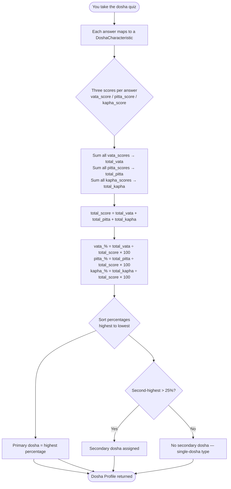

In Ayurveda, every aspect of your health is governed by three fundamental biological energies called **doshas**. These energies — Vata, Pitta, and Kapha — are present in every person, every food, every season, and every moment of the day. Your unique combination of these three forces determines how your body functions, how your mind processes experiences, and why you thrive under some conditions while struggling under others. Mydva measures your personal dosha profile through a structured quiz and uses the results as the foundation for every recommendation it provides.

## What Are the Doshas?

The doshas originate from the five classical elements of Ayurveda: space (Akasha), air (Vayu), fire (Tejas), water (Jala), and earth (Prithvi). Each dosha is composed of two elements, giving it a distinct set of qualities:

| Dosha | Elements | Core Qualities |
|-------|----------|----------------|
| **Vata** | Space + Air | Light, dry, mobile, cold, subtle, rough |
| **Pitta** | Fire + Water | Hot, sharp, oily, light, liquid, spreading |
| **Kapha** | Water + Earth | Heavy, slow, cool, oily, smooth, dense, stable |

These qualities influence everything from your digestion and sleep patterns to your emotional temperament and susceptibility to specific health conditions. When a dosha is in balance, its positive qualities express themselves freely. When it is aggravated or deficient, characteristic symptoms and conditions arise.

---

## Vata: The Energy of Movement

Vata is the force behind all movement and communication in the body. It governs breathing, the nervous system, circulation, and the movement of thoughts through the mind.

### Physical Traits
- Naturally thin or lean frame with prominent joints and veins
- Dry skin, hair, and nails that tend to crack or become rough
- Irregular appetite and digestion that varies day to day
- Light, interrupted sleep and tendency toward cold hands and feet
- Quick, light, and energetic movements

### Mental and Emotional Tendencies
- Creative, imaginative, and enthusiastic
- Quick to learn new information, but equally quick to forget
- Adaptable and spontaneous, preferring variety to routine
- When balanced: joyful, lively, and communicative
- When imbalanced: anxious, fearful, scattered, and overwhelmed

### When Vata Is Balanced
You feel energetic, creative, and mentally sharp. Digestion works smoothly, sleep is restful, and you move through your day with enthusiasm and adaptability.

### When Vata Is Imbalanced
Excess Vata manifests as anxiety, insomnia, constipation, dry skin, joint pain, and a racing or scattered mind. You may feel ungrounded, indecisive, or prone to worry.

### Common Health Conditions Linked to Vata
- Anxiety and stress (Chittodvega)
- Insomnia and sleep disorders
- Constipation and bloating
- Arthritis and joint pain (Sandhivata)
- Nervous system disorders
- Dry skin conditions

---

## Pitta: The Energy of Transformation

Pitta governs all metabolic processes — digestion, absorption, assimilation, and the biochemical transformations that convert food into energy. It is the fire that drives your intellect and your ambition.

### Physical Traits
- Medium, well-proportioned build with good muscle development
- Warm, oily, sensitive skin that may flush easily and is prone to redness
- Strong, sharp appetite — can become irritable when meals are missed
- Moderate, sound sleep, though sometimes disturbed by vivid dreams
- Warm body temperature with tendency to sweat easily

### Mental and Emotional Tendencies
- Focused, analytical, and highly intelligent
- Natural leaders with a competitive, goal-oriented mindset
- Precise, articulate, and detail-driven communicators
- When balanced: courageous, confident, and purposeful
- When imbalanced: critical, irritable, controlling, or prone to anger

### When Pitta Is Balanced
Your digestion is strong, your thinking is clear, and you feel motivated and focused. You achieve your goals efficiently and lead others with warmth and confidence.

### When Pitta Is Imbalanced
Excess Pitta produces inflammation, heartburn, skin rashes, irritability, and an excessive drive that tips into perfectionism or anger. You may feel overheated, critical, or impatient.

### Common Health Conditions Linked to Pitta
- Acid reflux and gastritis
- Inflammatory skin conditions such as eczema and psoriasis (Kushtha)
- Hypertension (Rakta Gata Vata)
- Liver and gallbladder disorders
- Migraine headaches
- Eye inflammation

---

## Kapha: The Energy of Structure

Kapha provides the body with its physical form, lubrication, and stability. It builds and maintains tissues, protects the joints, and supplies the immune system with its strength.

### Physical Traits
- Large, solid, or well-padded frame with slow metabolism
- Smooth, moist, thick skin that ages gracefully
- Steady, heavy appetite with strong digestion but slow metabolism
- Deep, prolonged sleep — can be difficult to wake
- Strong, enduring stamina once activity begins

### Mental and Emotional Tendencies
- Calm, patient, and loyal with a long, stable memory
- Thoughtful, methodical decision-makers who prefer consistency
- Deeply compassionate and nurturing toward others
- When balanced: steady, loving, content, and supportive
- When imbalanced: possessive, withdrawn, resistant to change, or lethargic

### When Kapha Is Balanced
You feel grounded, stable, and deeply nourished. Your immune system is strong, your relationships are steady, and your endurance carries you through long tasks with ease.

### When Kapha Is Imbalanced
Excess Kapha leads to weight gain, congestion, lethargy, depression, and over-attachment. You may feel heavy, slow, or emotionally stuck.

### Common Health Conditions Linked to Kapha
- Obesity and slow metabolism
- Diabetes (Prameha — a Kapha-dominant disorder)
- Respiratory congestion and sinus problems
- Hypothyroidism
- Depression and emotional stagnation
- High cholesterol

---

## How Mydva Calculates Your Dosha Profile

Mydva's dosha assessment is a deterministic scoring algorithm. Every question in your quiz maps to a `DoshaCharacteristic` — a named trait (such as body frame, skin type, or sleep pattern) — and each possible answer carries three scores: one for Vata, one for Pitta, and one for Kapha.

<Note>
The threshold of **25%** for secondary dosha assignment is deliberate. In a perfectly balanced tridoshic person, each dosha would hold exactly 33.3%. Requiring the second-place dosha to exceed 25% ensures that a meaningful secondary influence is present before it is recognised.
</Note>

---

## Interpreting Your Dosha Percentages

Once Mydva calculates your three percentages, it interprets them according to the following rules:

| Scenario | What It Means | Prakriti Type |
|----------|--------------|---------------|
| One dosha ≥ ~45%, second ≤ 25% | Strong single-dosha dominance | Vata, Pitta, or Kapha |
| Highest dosha leads clearly, second > 25% | Dual-dosha type | Vata-Pitta, Vata-Kapha, or Pitta-Kapha |
| All three doshas within a similar range | Near-equal balance | Tridosha (Sama Prakriti) |

Your primary dosha is always the one with the highest percentage. Your secondary dosha is assigned only when the runner-up exceeds 25%, indicating a meaningful co-dominant influence.

---

## How Mydva Uses Your Dosha Profile

Your dosha percentages are not just a label — they are the input that drives every personalised recommendation in the platform. Mydva's AI engine receives your full dosha profile (primary dosha, secondary dosha, and all three percentages) alongside your personal information, medical history, lifestyle data, and current health concerns. It then generates targeted guidance across six domains:

- **Dietary recommendations** — foods to favour and avoid based on your dominant qualities
- **Lifestyle modifications** — daily routine adjustments that pacify your most aggravated dosha
- **Exercise guidance** — intensity and type of movement best suited to your constitution
- **Herbal remedies** — specific Ayurvedic herbs and formulations matched to your dosha state
- **Therapeutic treatments** — classical Ayurvedic therapies appropriate for your profile
- **Warnings and precautions** — contraindications and interactions to be aware of

<Warning>
Your dosha profile is a guide to understanding your constitutional tendencies — it is not a medical diagnosis. Always consult a qualified healthcare professional or licensed Ayurvedic practitioner before making significant changes to your diet, supplements, or treatment plan.
</Warning>
