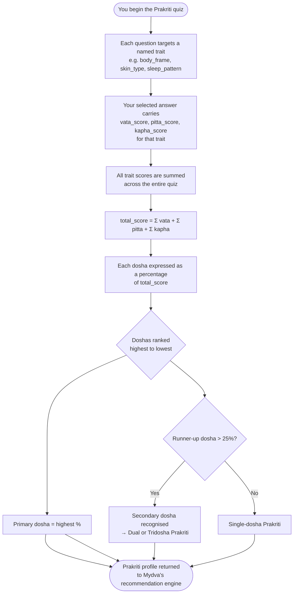

Your Prakriti is your Ayurvedic blueprint — the unique combination of doshas that was set at the moment of your conception and remains fundamentally constant throughout your life. It determines how your body metabolises food, how your mind processes stress, what diseases you are predisposed to, and which lifestyle choices will help you thrive. Mydva analyses your quiz responses to establish your Prakriti, then uses it as the baseline reference point for every piece of guidance the platform offers.

## Prakriti vs. Vikriti: Your Blueprint and Your Current State

Understanding the difference between these two concepts is essential to getting the most from Mydva.

**Prakriti** (प्रकृति) is your inherent, birth constitution — the dosha ratio you were born with. It is your personal standard of health. When your doshas are in the proportions defined by your Prakriti, you feel your best.

**Vikriti** (विकृति) is your current state — the dosha imbalance that exists right now as a result of diet, environment, stress, seasons, and lifestyle choices. Vikriti describes where you are, while Prakriti describes where you naturally belong.

| | Prakriti | Vikriti |
|---|---|---|
| **What it is** | Birth constitution | Current imbalance |
| **When it forms** | At conception | Continuously, throughout life |
| **Does it change?** | No | Yes — with every meal, season, and experience |
| **Purpose in Mydva** | Your health baseline | Reflects current symptoms and concerns |

<Note>
Mydva's quiz primarily captures your Prakriti by asking about your lifelong, baseline tendencies (e.g., your natural body frame, your typical digestion) rather than how you feel today. Your current health concerns and symptoms — which may reflect Vikriti — are gathered separately during the consultation intake.
</Note>

---

## The Seven Prakriti Types

Because everyone has all three doshas in varying proportions, Ayurveda recognises seven possible constitutional types:

### 1. Vata Prakriti
Vata is the dominant force. You have a naturally lean build, creative and fast-moving mind, dry skin, variable digestion, and light sleep. You excel in spontaneity and imagination, and you must work consciously to build stability, warmth, and routine into your life.

### 2. Pitta Prakriti
Pitta is the dominant force. You have a medium, muscular build, sharp intellect, strong digestion, and a tendency toward warmth and intensity. You thrive on purpose and challenge, and your primary task is to moderate the heat and sharpness that can turn productivity into inflammation or irritability.

### 3. Kapha Prakriti
Kapha is the dominant force. You have a sturdy or well-padded build, calm temperament, slow-but-steady digestion, and deep, restorative sleep. You offer great loyalty and endurance, and your health work focuses on maintaining movement, stimulation, and metabolic fire.

### 4. Vata-Pitta Prakriti
Both Vata and Pitta are significantly elevated. You combine Vata's lightness and creativity with Pitta's focus and fire. You may experience both anxiety (Vata) and inflammation (Pitta) and need practices that ground you while also cooling excess heat.

### 5. Vata-Kapha Prakriti
Both Vata and Kapha are significantly elevated. This is a less common but distinct type in which the airy, mobile qualities of Vata and the heavy, stable qualities of Kapha create a complex interplay. You may alternate between bursts of activity and long periods of inertia.

### 6. Pitta-Kapha Prakriti
Both Pitta and Kapha are significantly elevated. You have strong digestion, robust physical endurance, and a determined will. The combination of fire and earth can make you powerful and resilient, but you must guard against excess heat expressed through inflammation and excess Kapha expressed through congestion or weight gain.

### 7. Tridosha (Sama Prakriti)
All three doshas are nearly equal. This is the rarest and, in classical Ayurveda, the most auspicious constitution. However, it also means you are sensitive to influences from all three sides — any imbalance can tip any of the three doshas, so awareness and daily routine become especially important.

---

## How Mydva's Quiz Determines Your Prakriti

Every answer you give in Mydva's dosha quiz is processed by the `DoshaAnalyzer` service, which implements a deterministic scoring algorithm directly tied to the `DoshaCharacteristic` data model.

The output is a `DoshaProfile` object containing your primary dosha, optional secondary dosha, and the precise percentage for each of the three doshas. This profile is stored with your account and passed to Mydva's AI engine each time you request a consultation or recommendation.

---

## How Your Prakriti Shapes All Recommendations

Your Prakriti is the lens through which every recommendation in Mydva is filtered. When the AI engine receives your consultation data, it is given your full dosha profile — primary dosha, secondary dosha, and all three percentages — and instructed to act as an experienced Ayurvedic practitioner who tailors every piece of advice to your constitution.

### Diet
Foods are classified by their effect on each dosha. A Vata-dominant person benefits from warm, oily, grounding foods and should minimise raw, cold, or dry foods. A Pitta-dominant person needs cooling, moderately heavy foods and should avoid spicy, fermented, or overheated preparations. A Kapha-dominant person benefits most from light, dry, stimulating foods and should reduce heavy, sweet, or cold preparations.

### Herbs and Formulations
Each herb in Ayurveda has a dosha affinity. Ashwagandha is deeply grounding and suits Vata; Shatavari cools and nourishes Pitta; Trikatu kindles digestive fire and counters Kapha. Your Prakriti determines which herbs Mydva recommends and in what form and dosage.

### Lifestyle and Daily Routine (Dinacharya)
The timing of your meals, the length and intensity of your exercise, the practices you use to wind down before sleep — all of these are adjusted to pacify your dominant dosha. Vata types benefit from consistent schedules and gentle, grounding practices. Pitta types benefit from moderate-intensity activity during cooler parts of the day. Kapha types benefit from vigorous morning exercise and stimulating routines.

### Exercise
Exercise intensity, duration, and type are matched to your Prakriti. Vata types do best with gentle, rhythmic movement like yoga, walking, and swimming. Pitta types thrive with moderate competitive activity — cycling, hiking, or team sports — practised without overheating. Kapha types need the most vigorous activity — running, dance, weight training — to sustain metabolic fire.

---

## Seasonal Influence on Your Prakriti Expression

While your Prakriti never changes, the seasons (Ritucharya) create predictable shifts in the external environment that aggravate or pacify specific doshas. Mydva is designed with this awareness in mind:

- **Autumn and early winter** (cold, dry, windy) aggravate **Vata** — even if Vata is not your primary dosha.
- **Late spring and summer** (hot, bright, intense) aggravate **Pitta** — everyone experiences more heat-related symptoms.
- **Late winter and early spring** (cold, damp, heavy) accumulate **Kapha** — the season of congestion, weight gain, and sluggishness.

<Note>
Seasonal adjustments to diet and routine are a core part of Ayurvedic preventive care. If you notice that your Mydva recommendations shift subtly over the year, this reflects the platform's awareness that your Prakriti interacts with the season you are currently living through.
</Note>

<Warning>
Prakriti assessment through a questionnaire provides a strong working approximation of your constitution, but a definitive Prakriti evaluation in classical Ayurveda also involves pulse diagnosis (Nadi Pariksha) and physical examination by a trained practitioner. Use Mydva's profile as a guide, and consider a formal consultation with a licensed Ayurvedic physician for deeper insight.
</Warning>
