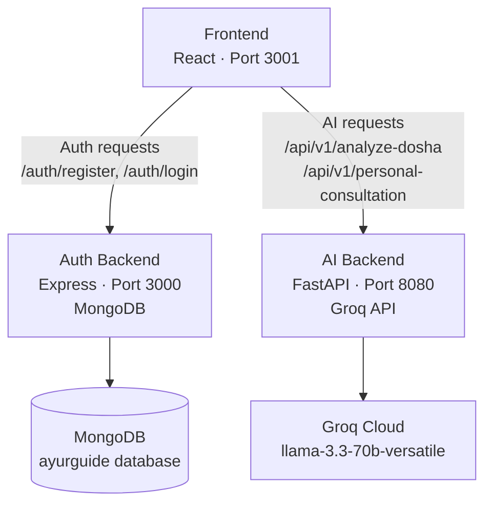

This guide walks you through a complete local installation of Mydva (AyurGuide) from a fresh clone to a fully running three-service stack. By the end you will have the React frontend, the Node.js Auth backend, and the Python AI backend all running and communicating with each other on your machine.

## Prerequisites

Before you begin, make sure the following tools are installed and accessible from your terminal:

| Tool | Minimum Version | Notes |
|---|---|---|
| **Node.js** | v18.0.0 | Includes `npm` v9+. Download from [nodejs.org](https://nodejs.org). |
| **Python** | v3.9 | Use `python3 --version` to verify. [python.org](https://www.python.org/downloads/). |
| **MongoDB** | Any current release | Run a local instance (`mongod`) or use a free [MongoDB Atlas](https://www.mongodb.com/atlas) cluster. |
| **Groq API Key** | — | Free key from [console.groq.com](https://console.groq.com). Required for AI features. |

---

## Architecture Overview

The diagram below shows how the three services connect. The Frontend communicates with both backends over HTTP; the two backends are independent of each other.



---

## Installation Steps

<Steps>
  ### Clone the Repository

  Open a terminal and clone the AyurGuide repository to your local machine:

  ```bash
  git clone https://github.com/GaurRitika/NCS_AyurGuide.git
  cd NCS_AyurGuide
  ```

  You should now see three top-level directories: `AuthBackend/`, `PythonBackend/`, and `Frontend/`.

  ---

  ### Set Up the Auth Backend

  The Auth backend is an Express.js service that handles user registration, login, and JWT issuance.

  Navigate to the `AuthBackend` directory and install dependencies:

  ```bash
  cd AuthBackend
  npm install
  ```

  Create a `.env` file in the `AuthBackend/` directory with the following content — replace the placeholder values with your own:

  ```env
  PORT=3000
  MONGO_URI=mongodb://localhost:27017/ayurguide
  JWT_SECRET=replace_with_a_long_random_string
  ```

  Start the Auth backend in development mode (with auto-reload via nodemon):

  ```bash
  npm run dev
  ```

  For production, use:

  ```bash
  npm start
  ```

  You should see output confirming the server is listening on port 3000 and that Mongoose has connected to MongoDB.

  ---

  ### Set Up the Python AI Backend

  The AI backend is a FastAPI service that runs Dosha analysis algorithms and calls the Groq LLM for personalised consultations.

  Open a **new terminal window**, navigate to `PythonBackend/`, and create a Python virtual environment:

  ```bash
  cd PythonBackend

  # macOS / Linux
  python3 -m venv venv
  source venv/bin/activate

  # Windows (Command Prompt)
  python -m venv venv
  .\venv\Scripts\activate
  ```

  Install all required Python packages:

  ```bash
  pip install -r requirements.txt
  ```

  Create a `.env` file in the `PythonBackend/` directory:

  ```env
  PORT=8080
  GROQ_API_KEY=gsk_xxxxxxxxxxxxxxxxxxxxxxxxxxxxxxxxxxxxxxxxxxxxxxxxxxxx
  ```

  Start the FastAPI server:

  ```bash
  python main.py
  ```

  Uvicorn will start and print the address where the server is listening. The interactive API documentation is immediately available at `http://localhost:8080/docs`.

  ---

  ### Set Up the Frontend

  Open a **third terminal window** and navigate to the `Frontend/` directory:

  ```bash
  cd Frontend
  npm install
  ```

  Create a `.env` file in `Frontend/`:

  ```env
  REACT_APP_AUTH_API=http://localhost:3000
  REACT_APP_AI_API=http://localhost:8080/api/v1
  ```

  Start the React development server:

  ```bash
  npm start
  ```

  Create React App will compile the application and automatically open `http://localhost:3001` in your default browser (port 3001 is used automatically if 3000 is already taken by the Auth backend).
</Steps>

<Tip>
Keep each service running in its own dedicated terminal tab or window throughout your development session. If you close the terminal running a backend, the frontend features that depend on it will stop working until you restart it. A tool like `tmux` or the split-pane feature in VS Code's integrated terminal makes managing three processes much easier.
</Tip>

---

## Verifying Your Installation

Once all three services are running, use the following checks to confirm everything is wired up correctly.

### Auth Backend health

Open your browser or run `curl` to hit the register endpoint with a test payload:

```bash
curl -X POST http://localhost:3000/auth/register \
  -H "Content-Type: application/json" \
  -d '{"FullName":"Test User","Email":"test@example.com","Password":"TestPass123"}'
```

A `200 OK` response with a user object confirms the Auth backend and MongoDB are both healthy.

### Python AI Backend health

Visit the FastAPI interactive documentation in your browser:

```
http://localhost:8080/docs
```

The Swagger UI lists all available endpoints — `POST /api/v1/analyze-dosha`, `GET /api/v1/recommendations/{dosha_type}`, and `POST /api/v1/personal-consultation`. You can execute test requests directly from this page. A visible list of routes confirms the Python backend started correctly and loaded your `GROQ_API_KEY`.

### Frontend

Navigate to `http://localhost:3001` (or `http://localhost:3000` if that port was free). The Mydva home page should load. Try registering a new account — a successful registration that redirects you to the dashboard confirms end-to-end connectivity between the Frontend and the Auth backend.
