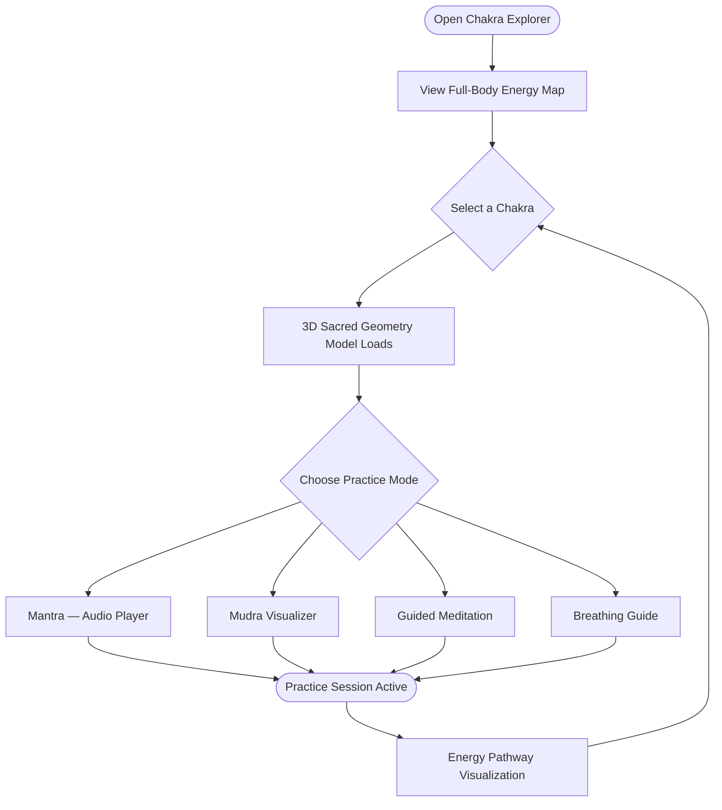

The Chakra Explorer is one of Mydva's most immersive features, bringing the ancient science of the body's energy centers to life through real-time 3D sacred geometry, resonant mantra audio, and guided wellness practices. Whether you are new to Ayurveda or a seasoned practitioner, the explorer gives you a visual and experiential entry point into understanding how your subtle energy body connects to your physical health and your unique Dosha constitution.

## What the 3D Chakra Explorer Is

The Chakra Explorer is an interactive section of your Mydva dashboard that lets you navigate all seven major chakras — the spinning energy wheels that Ayurveda and yogic tradition describe as governing every aspect of physical, emotional, and spiritual well-being. Each chakra is rendered as an animated 3D sacred geometry model — its yantra pattern rotating and pulsing at the chakra's associated healing frequency. Alongside the visual, you get a complete toolkit of healing practices drawn directly from classical Ayurvedic and yogic sources: seed mantras, hand mudras, guided meditations, pranayama breathing guides, and a full energy pathway visualization that shows how each chakra relates to the others.

## How to Navigate to the Chakra Explorer

<Steps>
  <Step title="Open your Mydva dashboard">
    Sign in to your Mydva account. You will land on the main dashboard showing your personal health summary.
  </Step>
  <Step title="Select Chakra Explorer from the sidebar">
    In the left navigation menu, click **Chakra Explorer**. The page loads with the full-body energy map displaying all seven chakras arranged along the spinal axis.
  </Step>
  <Step title="Choose a chakra to explore">
    Click on any chakra orb on the energy map, or scroll down to the chakra grid and click a card. The selected chakra's detail page opens immediately with the 3D model animating into view.
  </Step>
  <Step title="Navigate between chakras">
    Use the **Previous** and **Next** arrows at the top of any detail page to move sequentially through the chakras, or click the mini-map in the sidebar to jump directly to any energy center.
  </Step>
</Steps>

## The Seven Chakras Available for Exploration

Mydva provides a complete journey through all seven classical chakras, each with its Sanskrit name, associated element, seed mantra, and healing frequency:

| # | English Name | Sanskrit Name | Element | Seed Mantra | Frequency |
|---|---|---|---|---|---|
| 1 | Root Chakra | **Muladhara** | Earth | LAM | 396 Hz |
| 2 | Sacral Chakra | **Swadhisthana** | Water | VAM | 417 Hz |
| 3 | Solar Plexus Chakra | **Manipura** | Fire | RAM | 528 Hz |
| 4 | Heart Chakra | **Anahata** | Air | YAM | 639 Hz |
| 5 | Throat Chakra | **Vishuddha** | Ether/Space | HAM | 741 Hz |
| 6 | Third Eye Chakra | **Ajna** | Light | OM | 852 Hz |
| 7 | Crown Chakra | **Sahasrara** | Cosmic Energy/Consciousness | AUM | 963 Hz |

## Features Within Each Chakra Detail Page

Every chakra opens a rich detail view with eight distinct interactive components.

<Accordion title="3D Sacred Geometry Visualization">
  The centrepiece of each chakra page is a real-time 3D model of the chakra's yantra — the geometric symbol that encodes its energy signature. The model rotates continuously and pulses at the chakra's solfeggio healing frequency. You can click and drag to spin the geometry manually, pinch to zoom on mobile, and tap the **Full Screen** button to fill your display with the animated form. The geometry is rendered in the chakra's classical color: deep red for Muladhara, vibrant orange for Swadhisthana, golden yellow for Manipura, emerald green for Anahata, sky blue for Vishuddha, indigo for Ajna, and violet-white for Sahasrara.
</Accordion>

<Accordion title="Healing Properties">
  Each detail page lists the chakra's associated physical body systems and emotional qualities. For example, Muladhara governs the skeletal structure, adrenal glands, and large intestine, while its emotional domain includes feelings of security, grounding, and trust. Swadhisthana governs the reproductive system, lower back, and water retention, with emotional qualities of creativity, passion, and relational flow. You also see recommended crystals, balancing foods, and suggested healing practices specific to that energy center.
</Accordion>

<Accordion title="Spiritual Significance">
  A dedicated section explains the chakra's position within the broader yogic and Ayurvedic cosmology — its relationship to the five great elements (Pancha Mahabhutas), the corresponding sense organ, the associated deity, and how imbalance in this center manifests in daily life. The Heart Chakra (Anahata), for instance, is described as the bridge between the lower three physical chakras and the upper three spiritual ones, making it the pivot point of the entire system.
</Accordion>

<Accordion title="Associated Mantras with Audio Player">
  The mantra panel displays the chakra's seed (bija) mantra in both Devanagari script and romanized transliteration, alongside the recommended chanting frequency. Press **Play** on the built-in audio player to hear a traditional recitation at the correct pitch and tempo. You can loop the audio for continuous practice, adjust playback speed, and set a countdown timer so the mantra session ends automatically after your chosen duration.
</Accordion>

<Accordion title="Mudra Visualizer">
  The Mudra Visualizer shows an animated 3D hand model demonstrating the correct finger position for the chakra's primary mudra. Rotate the model to see the hand position from any angle. Step-by-step text instructions appear alongside the visual, describing which fingers to bring together, the amount of pressure to apply, and how long to hold the mudra during practice.
</Accordion>

<Accordion title="Guided Meditation">
  Each chakra includes a fully narrated guided meditation aligned to that energy center's themes. The meditations range from 5 to 20 minutes and incorporate visualization prompts, body scanning, and affirmations drawn from classical Ayurvedic texts. Press **Begin Meditation** to start the audio narration. A soft ambient soundscape plays underneath, tuned to the chakra's solfeggio frequency to reinforce the energetic work.
</Accordion>

<Accordion title="Breathing Guide">
  The pranayama (breathing) guide walks you through the specific breath technique most effective for activating and balancing that chakra. The Solar Plexus Chakra (Manipura), for example, features Kapalabhati (skull-shining breath) and Agni Sara. An animated ring expands and contracts on screen to pace your inhale, retention, and exhale. You choose your experience level — beginner, intermediate, or advanced — and the guide adjusts the ratio and round count accordingly.
</Accordion>

<Accordion title="Energy Pathway Visualization">
  A full-body silhouette shows the energy pathways (nadis) that connect the selected chakra to the others. The three primary nadis — Ida (lunar), Pingala (solar), and Sushumna (central channel) — are rendered in distinct colors. Animated particles flow along the active pathway so you can see how, for example, an imbalance in Vishuddha (Throat) can disrupt the flow of energy between Anahata (Heart) and Ajna (Third Eye). Hover over any point on the pathway to read about the corresponding reflex region or marma point.
</Accordion>

## Chakra Explorer Flow

## How Chakras Connect to Your Dosha Profile

Your Dosha constitution — determined by the quiz in your Mydva profile — directly informs the chakra recommendations you see. The platform maps each dosha to its primary energy centers:

- **Vata** types are most closely connected to Ajna (Third Eye), Vishuddha (Throat), and Anahata (Heart), reflecting Vata's affinity for the ether and air elements.
- **Pitta** types are associated with Manipura (Solar Plexus) and Ajna (Third Eye), mirroring Pitta's fire-driven drive for transformation and clarity.
- **Kapha** types are rooted in Muladhara (Root) and Swadhisthana (Sacral), reflecting Kapha's earth and water qualities of stability and creative flow.

After completing your Dosha quiz, your dashboard highlights the chakras most relevant to your constitution in **Recommended** badges, and the guided meditations within those chakras are automatically adjusted in tone and imagery to match your dosha-specific needs.

## Sacred Geometry Elements

The visual layer of the Chakra Explorer draws from three classical categories of sacred geometry:

- **Yantra patterns** — Two-dimensional symbolic diagrams (triangles, hexagons, lotuses) that encode the chakra's energy signature. Each yantra is geometrically precise and animated to rotate in sync with the healing frequency.
- **Energy pathways** — The three primary nadis and seventy-two thousand subsidiary channels are rendered as luminous lines flowing through the body silhouette, updating in real time as you interact with each chakra.
- **Sacred animations** — Petal counts (4 petals for Muladhara, 6 for Swadhisthana, 10 for Manipura, 12 for Anahata, 16 for Vishuddha, 2 for Ajna, and 1,000 for Sahasrara) animate dynamically, pulsing and unfurling in correspondence with the active practice session.

## Tips for Beginners

<Note>
  You do not need prior knowledge of chakras, yoga, or Ayurveda to use the Chakra Explorer. Every panel includes a plain-language explanation of each concept before presenting the practice itself.
</Note>

<Tip>
  Start your journey at **Muladhara (Root Chakra)**. Classical Ayurvedic tradition teaches that healing flows most naturally from the ground upward — grounding and stabilizing the foundation first makes all higher practices more effective. Spend at least two or three sessions with the Root Chakra's breathing guide and mantra before moving to Swadhisthana.
</Tip>

<Tip>
  Use the **Energy Pathway Visualization** to understand why a symptom you are experiencing in one area of your body or emotional life may originate in a completely different chakra. This systems-level view is one of the most powerful educational tools Mydva offers.
</Tip>

<Warning>
  The Chakra Explorer is designed as a complementary wellness tool. It is not a substitute for medical diagnosis or treatment. If you are experiencing significant physical or mental health concerns, please consult a qualified practitioner through Mydva's **Expert Talk** feature or your own healthcare provider.
</Warning>
