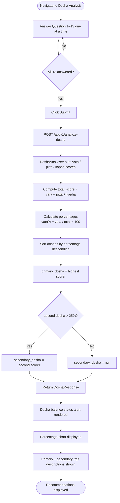

Mydva's Dosha Analysis is your entry point into personalised Ayurvedic health. By answering 13 questions about your physical traits, daily patterns, and mental tendencies, the platform calculates your unique ratio of vata, pitta, and kapha — the three biological energies that Ayurveda uses to explain every aspect of your constitution. Your results feed directly into the AI-powered Personal Consultation, making it important to complete the quiz before booking a consultation session.

## What the Dosha Analysis does

The Dosha Analysis collects trait-level observations and converts them into numerical scores for each of the three doshas. Each answer you give carries a weighted score: selecting the option that aligns most strongly with a dosha awards that dosha **3 points**, a moderate alignment awards **1 point**, and no alignment awards **0 points**. Once all 13 traits are evaluated, `DoshaAnalyzer` totals the vata, pitta, and kapha scores across every answer, expresses each as a percentage of the combined total, and identifies your primary dosha (highest percentage) and secondary dosha (any dosha scoring above 25%). The results screen then displays a colour-coded percentage chart alongside trait descriptions for each dominant dosha.

<Note>
  Your dosha result reflects your **current constitution** as reported through the quiz. It is not a clinical diagnosis. For the most accurate reading, answer each question based on your long-term, natural tendencies rather than your current temporary state.
</Note>

## Taking the quiz

<Steps>
  <Step title="Navigate to Dosha Analysis">
    Sign in to your Mydva dashboard and select **Dosha Analysis** from the main navigation menu. The quiz opens on a single card that shows your progress at the top with a linear progress bar.
  </Step>
  <Step title="Answer each question category">
    The quiz presents one question at a time. Read the question and the helper text beneath it, then select the option that best describes your natural, long-standing tendency. Use the **Next** button to advance, or **Previous** to revisit an earlier answer. You must answer the current question before you can move forward.
  </Step>
  <Step title="Submit your answers">
    After answering the 13th question, the **Submit** button becomes active. Click it to send your responses to the backend. All 13 questions must be answered before submission is allowed.
  </Step>
  <Step title="Review your results">
    The Results screen loads automatically. You will see your dosha balance status alert (Balanced, Slightly Imbalanced, or Imbalanced), a percentage bar chart for each dosha, and a detailed trait list for your primary and secondary doshas. A **Get Personalized Consultation** button at the bottom takes you directly to the next step.
  </Step>
</Steps>

## Quiz question categories

The quiz covers 13 distinct physiological and behavioural traits. Every trait maps your observation to one of the three doshas.

<Accordion title="Physical traits (7 questions)">
  | Question | Vata option | Pitta option | Kapha option |
  |---|---|---|---|
  | **Body Frame** | Very Slim | Medium | Large |
  | **Skin Type** | Dry / Rough | Warm / Sensitive | Thick / Oily |
  | **Hair Color** | Black | Brown | Blonde |
  | **Lip Color** | Red | Pink | Brown |
  | **Eyes Color** | Blue | Green | Brown |
  | **Skin Color** | White | Brown | Black |
  | **Body Odor** | Sweet | Salty | Sour |
</Accordion>

<Accordion title="Functional & behavioural traits (6 questions)">
  | Question | Vata option | Pitta option | Kapha option |
  |---|---|---|---|
  | **Sleep Pattern** | Light / Irregular | Moderate | Deep / Heavy |
  | **Digestion** | Irregular | Strong / Sharp | Slow / Steady |
  | **Response to Stress** | Anxiety / Worry | Irritation / Anger | Withdrawal / Calm |
  | **Weather Sensitivity** | Sensitive | Moderate | Resistant |
  | **Sweat Production** | Little | Moderate | Heavy |
  | **Appetite** | Little | Moderate | Heavy |
</Accordion>

## Complete Dosha Analysis flow



## Interpreting your results

### Balance status alert

The results page opens with a colour-coded alert that summarises how balanced your three doshas are relative to the ideal equal distribution (33.3 % each):

| Status | Condition | Alert colour |
|---|---|---|
| **Balanced** | Maximum deviation ≤ 10 % from 33.3 % | Green (success) |
| **Slightly Imbalanced** | Maximum deviation between 10 % and 20 % | Blue (info) |
| **Imbalanced** | Maximum deviation > 20 % | Orange (warning) |

### Percentage chart

Three colour-coded progress bars show your vata (purple), pitta (red), and kapha (green) percentages. These are computed from the raw integer scores accumulated across all 13 trait answers and rounded to two decimal places.

### Primary dosha

The dosha with the highest percentage is your **primary dosha**. The results card lists four characteristic traits for that dosha:

- **Vata (Air & Space):** Quick thinking and adaptable · Creative and enthusiastic · Light and agile in movement · Variable energy and appetite
- **Pitta (Fire & Water):** Intelligent and sharp-minded · Goal-oriented and organized · Strong digestion and metabolism · Natural leaders with strong will
- **Kapha (Earth & Water):** Patient and thoughtful · Calm and steady · Strong and enduring · Nurturing and supportive

### Secondary dosha

If the second-highest dosha exceeds **25%**, it is shown as a **Secondary Influence** with its own trait list. If it falls at or below 25%, no secondary dosha is displayed, indicating a more single-dosha constitution.

<Tip>
  A strong secondary dosha (above 25%) means you likely have a **dual-dosha constitution** (e.g., Vata-Pitta). When filling in your Personal Consultation, mention both doshas in the **Primary Health Concerns** field for more targeted recommendations.
</Tip>

## Recommendations after the quiz

Immediately below the dosha trait descriptions, a **Next Steps** section links you to the Personal Consultation. The recommendations in the Dosha Analysis screen are introductory; the full dietary, herbal, lifestyle, and therapeutic recommendations are generated in the consultation flow, where your dosha profile is combined with your age, weight, medical history, and health concerns.

## Using your results in the Personal Consultation

When you navigate to the Personal Consultation after completing the quiz, Mydva passes your `DoshaProfile` — including `primary_dosha`, `secondary_dosha`, and all three percentages — into the Groq LLM prompt. This gives the model the constitutional context it needs to tailor every recommendation section to your specific dosha balance. You do not need to re-enter your dosha manually; it is pre-populated from your quiz result.

## API reference

### Request — `POST /api/v1/analyze-dosha`

The request body is a JSON object whose keys are the 13 trait names and whose values are `DoshaCharacteristic` objects. The frontend computes scores automatically: the selected dosha receives **3 points**, the second most-related dosha receives **1 point**, and the remaining dosha receives **0 points**.

<ParamField body="body_frame" type="DoshaCharacteristic">
  Body frame trait scores.
  <Expandable title="DoshaCharacteristic fields">
    <ParamField body="trait_name" type="string" required>
      Machine-readable trait identifier. Must match the key name (e.g. `"body_frame"`).
    </ParamField>
    <ParamField body="vata_score" type="integer" required>
      Vata affinity score for this trait. Value is `3`, `1`, or `0`.
    </ParamField>
    <ParamField body="pitta_score" type="integer" required>
      Pitta affinity score for this trait. Value is `3`, `1`, or `0`.
    </ParamField>
    <ParamField body="kapha_score" type="integer" required>
      Kapha affinity score for this trait. Value is `3`, `1`, or `0`.
    </ParamField>
  </Expandable>
</ParamField>

<ParamField body="skin_type" type="DoshaCharacteristic">
  Skin type trait scores. Same schema as `body_frame`.
</ParamField>

<ParamField body="sleep_pattern" type="DoshaCharacteristic">
  Sleep pattern trait scores. Same schema as `body_frame`.
</ParamField>

<ParamField body="digestion" type="DoshaCharacteristic">
  Digestion trait scores. Same schema as `body_frame`.
</ParamField>

<ParamField body="stress_response" type="DoshaCharacteristic">
  Stress response trait scores. Same schema as `body_frame`.
</ParamField>

<ParamField body="weather_sensitivity" type="DoshaCharacteristic">
  Weather sensitivity trait scores. Same schema as `body_frame`.
</ParamField>

<ParamField body="sweat_production" type="DoshaCharacteristic">
  Sweat production trait scores. Same schema as `body_frame`.
</ParamField>

<ParamField body="Appetite" type="DoshaCharacteristic">
  Appetite trait scores. Same schema as `body_frame`.
</ParamField>

<ParamField body="hair_color" type="DoshaCharacteristic">
  Hair colour trait scores. Same schema as `body_frame`.
</ParamField>

<ParamField body="lip_color" type="DoshaCharacteristic">
  Lip colour trait scores. Same schema as `body_frame`.
</ParamField>

<ParamField body="eyes_color" type="DoshaCharacteristic">
  Eye colour trait scores. Same schema as `body_frame`.
</ParamField>

<ParamField body="skin_color" type="DoshaCharacteristic">
  Skin colour trait scores. Same schema as `body_frame`.
</ParamField>

<ParamField body="body_odor" type="DoshaCharacteristic">
  Body odour trait scores. Same schema as `body_frame`.
</ParamField>

**Full request example**

```json
{
  "body_frame": {
    "trait_name": "body_frame",
    "vata_score": 3,
    "pitta_score": 1,
    "kapha_score": 0
  },
  "skin_type": {
    "trait_name": "skin_type",
    "vata_score": 3,
    "pitta_score": 1,
    "kapha_score": 0
  },
  "sleep_pattern": {
    "trait_name": "sleep_pattern",
    "vata_score": 0,
    "pitta_score": 3,
    "kapha_score": 1
  },
  "digestion": {
    "trait_name": "digestion",
    "vata_score": 0,
    "pitta_score": 3,
    "kapha_score": 1
  },
  "stress_response": {
    "trait_name": "stress_response",
    "vata_score": 3,
    "pitta_score": 1,
    "kapha_score": 0
  },
  "weather_sensitivity": {
    "trait_name": "weather_sensitivity",
    "vata_score": 3,
    "pitta_score": 1,
    "kapha_score": 0
  },
  "sweat_production": {
    "trait_name": "sweat_production",
    "vata_score": 3,
    "pitta_score": 1,
    "kapha_score": 0
  },
  "Appetite": {
    "trait_name": "Appetite",
    "vata_score": 3,
    "pitta_score": 1,
    "kapha_score": 0
  },
  "hair_color": {
    "trait_name": "hair_color",
    "vata_score": 3,
    "pitta_score": 1,
    "kapha_score": 0
  },
  "lip_color": {
    "trait_name": "lip_color",
    "vata_score": 0,
    "pitta_score": 3,
    "kapha_score": 1
  },
  "eyes_color": {
    "trait_name": "eyes_color",
    "vata_score": 3,
    "pitta_score": 1,
    "kapha_score": 0
  },
  "skin_color": {
    "trait_name": "skin_color",
    "vata_score": 3,
    "pitta_score": 1,
    "kapha_score": 0
  },
  "body_odor": {
    "trait_name": "body_odor",
    "vata_score": 3,
    "pitta_score": 1,
    "kapha_score": 0
  }
}
```

### Response

```json
{
  "status": "success",
  "data": {
    "primary_dosha": "vata",
    "secondary_dosha": "pitta",
    "vata_percentage": 63.27,
    "pitta_percentage": 28.57,
    "kapha_percentage": 8.16,
    "recommendations": {
      "overview": {
        "condition_analysis": [
          "Your Vata dominance influences your health patterns and tendencies."
        ],
        "dosha_impact": [
          "Elevated Vata increases susceptibility to anxiety, dry skin, and irregular digestion."
        ]
      },
      "recommendations": {
        "dietary": [
          "Favour warm, oily, and grounding foods such as root vegetables and ghee.",
          "Avoid cold, raw, and dry foods that aggravate Vata."
        ],
        "lifestyle": [
          "Establish a consistent daily routine to calm the Vata tendency toward irregularity."
        ],
        "herbal": [
          "Ashwagandha — 500 mg with warm milk at bedtime to reduce Vata-related anxiety."
        ],
        "therapeutic": [
          "Abhyanga (self-oil massage) daily with sesame oil to nourish dry Vata tissues."
        ],
        "exercise": [
          "Gentle yoga, tai chi, or walking — 30 minutes at a moderate pace, 5 days per week."
        ]
      },
      "warnings": [
        "Consult a licensed Ayurvedic practitioner or physician before beginning any herbal regimen."
      ]
    }
  },
  "error": null
}
```

<ResponseField name="status" type="string">
  `"success"` when the analysis completes without error; `"error"` otherwise.
</ResponseField>

<ResponseField name="data.primary_dosha" type="string">
  The dominant dosha: `"vata"`, `"pitta"`, or `"kapha"`.
</ResponseField>

<ResponseField name="data.secondary_dosha" type="string | null">
  The second-highest dosha if its percentage exceeds 25%; otherwise `null`.
</ResponseField>

<ResponseField name="data.vata_percentage" type="float">
  Vata's share of the total raw score, rounded to two decimal places (0–100).
</ResponseField>

<ResponseField name="data.pitta_percentage" type="float">
  Pitta's share of the total raw score, rounded to two decimal places (0–100).
</ResponseField>

<ResponseField name="data.kapha_percentage" type="float">
  Kapha's share of the total raw score, rounded to two decimal places (0–100).
</ResponseField>

<ResponseField name="data.recommendations" type="object">
  Structured recommendation object with `overview` (condition analysis and dosha impact), `recommendations` (dietary, lifestyle, herbal, therapeutic, exercise), and `warnings` arrays.
</ResponseField>

<ResponseField name="error" type="string | null">
  Error message string if `status` is `"error"`; otherwise `null`.
</ResponseField>
