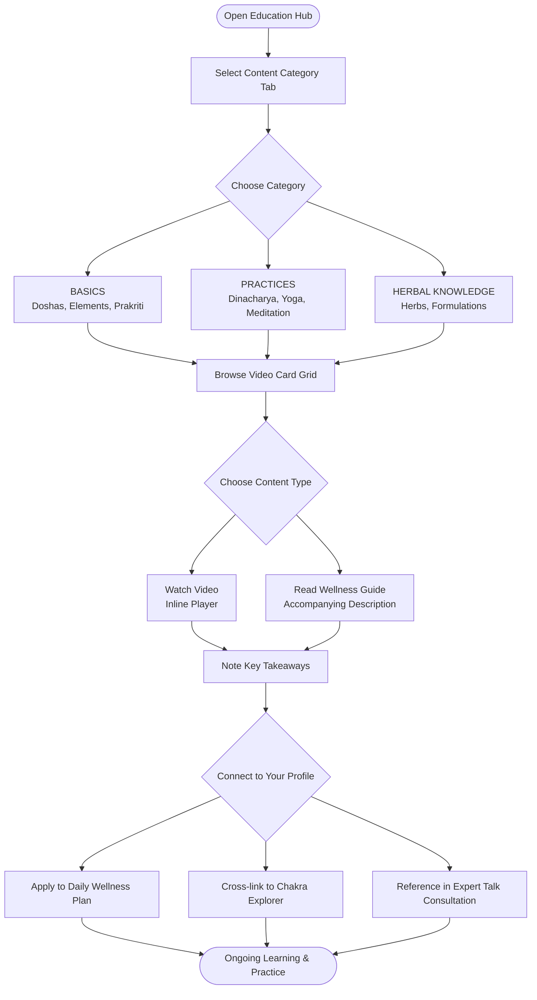

The Mydva Education Hub is your on-demand library for learning Ayurveda at your own pace. From introductory explainers on the three doshas to deep dives into classical herbal knowledge and daily wellness routines, the hub brings together curated video content and practical wellness guides in one organized, easy-to-navigate space. Everything you find here is designed to translate ancient Ayurvedic wisdom into everyday knowledge you can apply immediately — and much of it connects directly back to your personal Dosha profile, so the most relevant content rises to the top.

## What the Education Hub Is

The Education Hub is a dedicated section of the Mydva platform that hosts structured educational content across the core disciplines of Ayurveda. Content is organized into tabbed categories so you can move fluidly from foundational theory to applied practice to herbal medicine without losing your place. Each piece of content is presented as a video card — a thumbnail-sized video player with a title and short description — making it easy to scan the library and jump into whichever topic interests you most. The hub is available to all registered Mydva users at no additional cost.

## Types of Content Available

The Education Hub currently features three primary content formats:

- **Instructional videos** — Embedded YouTube videos covering topics from the philosophical foundations of Ayurveda through to specific therapeutic practices. Videos range from five-minute introductions to thirty-minute in-depth lessons.
- **Wellness guides** — Concise written summaries that accompany video content, capturing the key takeaways and actionable steps from each lesson.
- **Practice demonstrations** — Videos that walk you through physical practices such as daily Ayurvedic routines (Dinacharya), yoga sequences, and self-care rituals so you can follow along in real time.

## How to Navigate the Education Section

<Steps>
  <Step title="Go to the Education Hub">
    From your Mydva dashboard, click **Education** in the left navigation sidebar. The Ayurvedic Education Center page loads with the Basics tab active by default.
  </Step>
  <Step title="Choose a content category">
    Three tabs sit at the top of the content area. Click any tab to switch the displayed video grid:
    - **BASICS** — Foundational topics including the history of Ayurveda, the Tridosha system, and the relationship between the body, mind, and environment.
    - **PRACTICES** — Applied wellness content including Dinacharya (daily routine), seasonal living (Ritucharya), yoga, and meditation.
    - **HERBAL KNOWLEDGE** — Lessons on essential Ayurvedic herbs, their properties (Gunas), taste (Rasa), post-digestive effect (Vipaka), and therapeutic uses.
  </Step>
  <Step title="Select a video to watch">
    Each category displays a two-column grid of video cards. Scroll through the grid and click the play button on any card to start the video. The video plays inline within its card — no new tab or external redirect required.
  </Step>
  <Step title="Read the accompanying description">
    Below each video player, a short description summarizes what the lesson covers. Use this to decide whether to watch the full video or move on to the next card in the grid.
  </Step>
</Steps>

## Content Categories in Detail

<Accordion title="Basics — Foundations of Ayurveda">
  The Basics tab is the ideal starting point if you are new to Ayurveda or want to deepen your theoretical understanding. Content here covers:

  - **Introduction to Ayurveda** — The philosophical and historical roots of Ayurveda as one of the world's oldest living medical systems, its relationship to the Vedas, and its core goal of maintaining health rather than simply treating disease.
  - **Understanding Doshas** — A detailed exploration of Vata (ether and air), Pitta (fire and water), and Kapha (earth and water) as constitutional types that govern every physiological and psychological function. You will learn how to recognize dominant dosha characteristics in yourself and others.
  - **The Five Elements** — How the Pancha Mahabhutas (earth, water, fire, air, and ether) combine to create the three doshas and underpin all Ayurvedic diagnosis and treatment.
  - **Prakriti and Vikriti** — The distinction between your innate constitutional type (Prakriti) and your current state of balance or imbalance (Vikriti), and why this difference is fundamental to personalized Ayurvedic care.
</Accordion>

<Accordion title="Practices — Daily Wellness and Lifestyle">
  The Practices tab moves from theory into lived experience. You will find video-guided walkthroughs of:

  - **Dinacharya (Daily Routine)** — How to structure your morning, afternoon, and evening around Ayurvedic principles — including oil pulling, tongue scraping, self-massage (Abhyanga), and meal timing aligned to your digestive fire (Agni).
  - **Ritucharya (Seasonal Routine)** — How to adjust your diet, sleep, exercise, and self-care practices to stay in balance as the seasons change.
  - **Yoga for Your Dosha** — Sequences and postures selected specifically to balance Vata, Pitta, or Kapha excess.
  - **Meditation practices** — Guided sessions designed around Ayurvedic principles of mental clarity (Sattvic mind), including mindfulness, mantra meditation, and Yoga Nidra.
</Accordion>

<Accordion title="Herbal Knowledge — Medicinal Plants and Formulations">
  The Herbal Knowledge tab provides lessons on the most widely used plants and preparations in classical Ayurvedic medicine:

  - **Common Ayurvedic Herbs** — In-depth coverage of Ashwagandha, Brahmi, Triphala, Neem, Turmeric, Ginger, Shatavari, and other foundational herbs — including their properties, traditional uses, and modern research context.
  - **Herbal formulations** — How classical formulations such as Chyawanprash, Trikatu, and Dashamoola are composed and what conditions they traditionally address.
  - **Kitchen medicine** — Practical guides to using spices and herbs already found in an everyday kitchen — cumin, coriander, fennel, cardamom — as preventive and therapeutic agents in daily cooking.
</Accordion>

## Video Player Features

Every video card in the Education Hub uses an embedded player with the following capabilities:

- **Inline playback** — Videos play directly in the page without redirecting you away from the hub.
- **Full-screen mode** — Click the expand icon in the player controls to watch in full screen, then press **Esc** to return to the content grid.
- **Playback controls** — Standard play, pause, seek bar, volume, and quality selector controls are available in the player's native control bar.
- **Autoplay is off by default** — Videos do not start until you press play, so you can browse the grid without unexpected audio.
- **Picture-in-picture (browser-supported)** — On compatible browsers, right-click the player to enable picture-in-picture mode and keep watching while you scroll the page or navigate to another section of Mydva.

## How Educational Content Connects to Your Health Profile

Mydva links the Education Hub to the Dosha assessment you completed during onboarding. Once your Prakriti result (Vata, Pitta, or Kapha) is recorded in your profile:

- Videos and practices most relevant to your constitution are surfaced prominently within each category tab.
- The **Basics** tab highlights the dosha overview video matching your type first, so you can begin with the content most directly relevant to your health.
- Practitioner notes from your **Expert Talk** consultations may reference specific Education Hub videos as follow-up reading or practice assignments, with direct links that take you straight to the recommended content.
- Chakra Explorer sessions for the chakras associated with your dosha are cross-linked within practice-category video descriptions, creating a unified learning path across features.

## Education Hub Learning Flow

<Tip>
  The single most effective place to start in the Education Hub is the **"Understanding Doshas"** video inside the Basics tab — but only after you have completed the Dosha quiz in your Mydva profile. Knowing your own Prakriti before watching the video transforms it from an abstract overview into a direct mirror of your own constitution. You will recognize specific tendencies, strengths, and vulnerabilities in the descriptions, which makes every subsequent lesson — on practices, herbs, and lifestyle — far more personally meaningful and immediately actionable.
</Tip>

<Note>
  New content is added to the Education Hub on an ongoing basis. Check back regularly to find updated video lessons and seasonal wellness guides. If there is a specific Ayurvedic topic you would like covered, use the **Feedback** option in your account settings to suggest it.
</Note>
