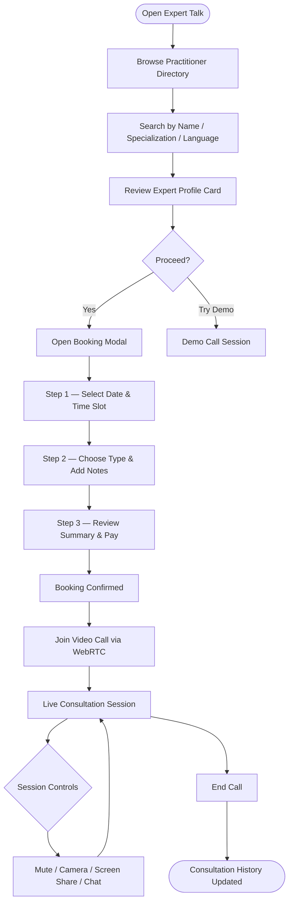

Expert Talk is Mydva's live consultation feature, connecting you directly with certified Ayurvedic practitioners for real-time video, audio, or chat appointments. You can browse an expert's specialization, read their credentials, check availability, book a slot in minutes, and join the call — all without leaving the platform. Your consultation history, practitioner notes, and downloadable prescriptions are stored securely in your account so your wellness journey remains continuous and well-documented.

## Browsing and Searching for Practitioners

The Expert Talk landing page presents a searchable directory of Ayurvedic doctors and specialists. A live search bar filters the list as you type, and each result card gives you everything you need to make an informed choice before booking.

### Search and Filter Options

Use the search bar at the top of the page to find practitioners by:

- **Name** — Type any part of a practitioner's name (e.g., "Sharma" or "Priya").
- **Specialization** — Search by dosha specialty (e.g., "Vata Dosha Specialist", "Pitta Dosha Expert").
- **Expertise area** — Enter a specific modality such as "Panchakarma", "Pulse Diagnosis", "Herbal Medicine", "Diet Planning", "Stress Management", or "Women's Health".
- **Language** — Type a language (e.g., "Gujarati", "Sanskrit", "Hindi") to find practitioners who consult in that language.

<Tip>
  Before your first search, complete the Dosha quiz in your Mydva profile. Your result (Vata, Pitta, or Kapha) is shown prominently on your dashboard and makes it immediately clear which specialist type is most relevant for your constitution.
</Tip>

### Expert Profile Cards

Each practitioner appears as a profile card displaying:

| Field | What It Shows |
|---|---|
| **Name & Photo** | Full name and professional portrait |
| **Specialization** | Primary dosha specialty or clinical focus |
| **Experience** | Years of practice (e.g., "15+ years") |
| **Rating** | Star rating out of 5, based on verified patient reviews |
| **Review Count** | Total number of reviews received |
| **Languages** | All languages the practitioner consults in |
| **Location** | City and country of practice |
| **Consultation Fee** | Per-session fee in USD |
| **Next Availability** | Whether the practitioner is available today, tomorrow, or later |
| **Expertise Chips** | Quick-glance tags for key specialties |

Click **Book Consultation** on any card to open the full booking flow, or click **Try Demo Call** to test your camera and microphone in a simulated session environment before committing to an appointment.

## Booking a Consultation

Booking follows a guided three-step process. The modal that opens shows the practitioner's name and specialization at the top, with a progress indicator tracking your position in the flow.

<Steps>
  <Step title="Select a date and time slot">
    Pick an available date using the calendar date picker. A grid of available time slots for that date appears beneath it — morning slots run from 9:00 AM through 11:30 AM, and afternoon slots from 2:00 PM through 4:30 PM (practitioner's local time). Tap the slot you prefer; it highlights to confirm your selection. You cannot proceed until both a date and a time are chosen.
  </Step>
  <Step title="Choose consultation type and add notes">
    Select how you would like to consult:
    - **Video Call** — Face-to-face consultation via live video (recommended for first appointments and physical assessments such as pulse diagnosis).
    - **Audio Call** — Voice-only consultation, ideal if your internet connection is limited or you prefer not to use a camera.
    - **Chat** — Text-based consultation for follow-up questions, prescription clarifications, or brief check-ins.

    Use the **Notes for the Expert** text area to describe your primary concern, current symptoms, and any relevant history. This gives the practitioner context before the session begins.
  </Step>
  <Step title="Review the booking summary and pay">
    A summary confirms the date, time, consultation type, and the practitioner's consultation fee. Select your preferred payment method — Credit/Debit Card, UPI, or Net Banking — then click **Confirm & Pay** to complete the booking. You receive an on-screen confirmation and an email with the session details and a one-click join link.
  </Step>
</Steps>

## The Video Consultation Session

When your appointment time arrives, open Expert Talk and click **Join Session** next to your upcoming booking. Mydva establishes a peer-to-peer WebRTC connection between you and the practitioner — no third-party video app is required.

### Joining via WebRTC

The platform uses browser-native WebRTC (Web Real-Time Communication) to transmit encrypted audio and video directly between you and the practitioner. When the session screen loads:

1. Your browser will request permission to access your **camera** and **microphone** — click **Allow**.
2. Your video preview appears in a small picture-in-picture window in the top-right corner of the screen.
3. The practitioner's video fills the main panel.
4. A connection status indicator in the top-left corner shows the current state: *connecting → connected → active*.

<Note>
  For the best video consultation experience, use a stable broadband or Wi-Fi connection with at least 2 Mbps upload and download speed. Video calls on mobile data are supported but may be affected by network fluctuations. If your connection drops, simply refresh the page — the session room remains open for up to five minutes to allow reconnection.
</Note>

### In-Session Controls

A control bar at the bottom of the video panel provides all session tools:

<Accordion title="Camera and Microphone Controls">
  - **Mute / Unmute** — Toggle your microphone on and off. The microphone icon turns red when muted so you always know your current state.
  - **Camera On / Off** — Toggle your video feed. When your camera is off, a placeholder avatar is shown to the practitioner in place of your video stream.
</Accordion>

<Accordion title="Screen Sharing">
  Click the **Share Screen** button to broadcast your screen to the practitioner. This is useful for sharing test results, reports, or images you have saved on your device. A browser permission dialog appears asking which window or tab to share. To stop sharing, click **Stop Sharing** in the control bar or dismiss the native browser sharing indicator.
</Accordion>

<Accordion title="In-Session Chat">
  Click the **Chat** icon to open a slide-out text panel alongside the video. You and the practitioner can exchange messages, links, and short notes in real time during the call. Chat messages are saved to your consultation record after the session ends, so you can refer back to anything discussed.
</Accordion>

<Accordion title="Ending the Session">
  Click the red **End Call** button (phone-down icon) in the control bar to close the connection cleanly. This stops your local camera and microphone, terminates the WebRTC peer connection, and disconnects both parties from the signaling server. After the call ends, you are automatically redirected to your Consultation History page.
</Accordion>

## Consultation Flow

## Viewing Consultation History

After each completed session, the Consultation History tab records:

- The practitioner's name, specialization, and profile photo
- The date, time, and duration of the session
- The consultation type (video, audio, or chat) shown with an icon
- The session status: **Completed**, **Scheduled**, or **Cancelled**
- Any practitioner notes added during or after the call
- A **Download Prescription** button if the practitioner issued a prescription

Click **View Details** on any past consultation to read the full session notes. Prescriptions download as PDF files for easy sharing with a pharmacist or for your personal records.

## Managing Health Records

The **Health Records** tab within Expert Talk lets you upload and manage personal medical documents that you can share with practitioners before or during a consultation.

<Steps>
  <Step title="Upload a document">
    Click **Upload Files** and select one or more files from your device. Supported formats include PDF, JPG, PNG, and common document types. A progress bar appears while files upload, and each file is tagged with its name, size, upload date, and status once complete.
  </Step>
  <Step title="Share records with a practitioner">
    During booking, reference your uploaded records in the **Notes for the Expert** field. During the session itself, use screen sharing or the in-session chat to direct the practitioner to specific documents.
  </Step>
  <Step title="Delete records you no longer need">
    Click the **Delete** (trash) icon on any record to remove it from your account immediately.
  </Step>
</Steps>

<Tip>
  Before your appointment, upload any recent blood work, Ayurvedic assessments, or specialist reports to the Health Records tab. Arriving at your consultation with your records already in the platform saves time and allows the practitioner to review your history before the session even begins. Bring your Dosha quiz results too — you can screenshot them from your profile dashboard.
</Tip>
