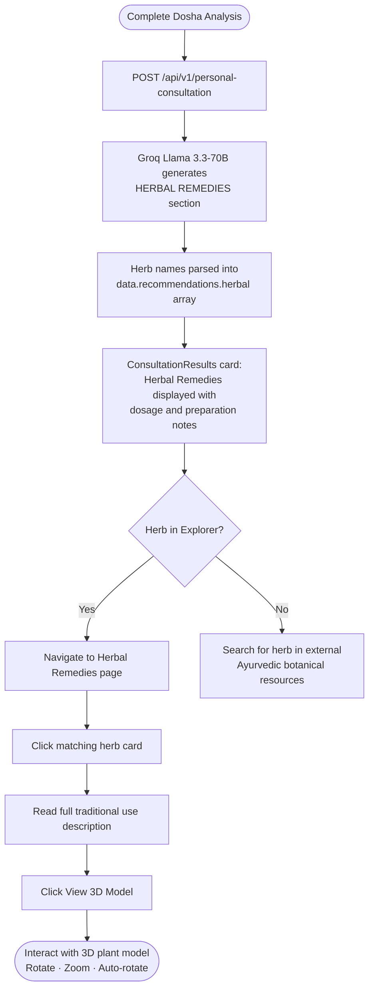

Mydva's Herbal Remedies Explorer brings Ayurvedic botany to life through interactive 3D plant models. Rather than reading a flat list of herbs, you can click any of the six featured plants to open a detailed view, then launch a full-screen WebGL model powered by React Three Fiber — rotate the plant in any direction, zoom in to inspect its structure, and let it auto-rotate while you read the description. The Explorer is designed to complement your Dosha Analysis and Personal Consultation results, giving you visual familiarity with the herbs that are most likely to appear in your wellness plan.

## What the Herbal Remedies Explorer is

The Explorer is a grid of six herb cards, each showing a photograph, common name, scientific name, and a one-line benefit summary. Clicking a card opens a detail modal with the full botanical description and a **View 3D Model** button. Pressing that button transitions to a full-screen 3D canvas with ambient lighting, a spotlight, and a point light arranged to reveal the model's depth. The `OrbitControls` component allows free rotation and zoom, and the model auto-rotates at a gentle speed by default so you can observe it without touching the mouse.

<Tip>
  Cross-reference the herbs shown here with the **Herbal Remedies** section of your Personal Consultation results. When the AI recommends Ashwagandha or Brahmi, come back to the Explorer to visualise the plant and review its traditional context before you source it.
</Tip>

## The 6 featured herbs

<Accordion title="1. Ashwagandha — Withania somnifera">
  **Common name:** Ashwagandha (also Winter Cherry, Indian Ginseng)

  **Scientific name:** *Withania somnifera*

  **Primary benefits:** Reduces stress and anxiety; improves physical strength and endurance; supports adrenal function; enhances sleep quality.

  **Associated doshas:** Primarily balances **Vata** and **Kapha**; may mildly increase **Pitta** in excess.

  **Traditional use:** One of the most revered rasayana (rejuvenating) herbs in Ayurveda, used for over 3,000 years as a tonic for the nervous system and reproductive tissues. Its name means "smell of horse," referencing both its distinctive aroma and its reputation for conferring equine strength and vitality. Classically prepared as a warm milk decoction (*ashwagandha ksheerapaka*) or as a churna (powder) taken with ghee.

  **3D model:** The model represents a shrubby perennial plant with ovate leaves. Use the 3D view to observe the characteristic trumpet-shaped flowers and orange berry fruits that distinguish *Withania somnifera* in the wild.
</Accordion>

<Accordion title="2. Turmeric — Curcuma longa">
  **Common name:** Turmeric (also Golden Spice, Haldi)

  **Scientific name:** *Curcuma longa*

  **Primary benefits:** Potent anti-inflammatory action via curcumin; antioxidant protection; supports joint health; aids liver function and bile secretion; promotes healthy digestion.

  **Associated doshas:** Balances **Vata**, **Pitta**, and **Kapha** in moderate doses (tri-doshic); excess use can aggravate Pitta and Vata.

  **Traditional use:** Turmeric has been a cornerstone of Ayurvedic medicine and Indian cooking for at least 4,000 years. It appears in classical texts as *Haridra* and is used for wound healing, skin health, respiratory conditions, and metabolic support. The famous golden milk preparation (*haldi doodh*) — turmeric powder simmered with warm milk, black pepper, and ghee — remains one of the most widely consumed Ayurvedic home remedies globally. Black pepper (piperine) increases curcumin bioavailability by up to 2,000%.

  **3D model:** The model depicts the rhizome (underground stem) of the turmeric plant — the part harvested, dried, and ground into powder. Rotate to see its characteristic knobbly, finger-like structure and bright orange interior.
</Accordion>

<Accordion title="3. Holy Basil / Tulsi — Ocimum sanctum">
  **Common name:** Holy Basil, Tulsi

  **Scientific name:** *Ocimum sanctum* (also *Ocimum tenuiflorum*)

  **Primary benefits:** Adaptogenic — helps the body normalise stress responses; supports immune function and respiratory health; antimicrobial and anti-inflammatory; promotes mental clarity and spiritual awareness.

  **Associated doshas:** Balances **Vata** and **Kapha**; use with care in highly elevated **Pitta** due to its warming quality.

  **Traditional use:** Tulsi is considered one of the most sacred plants in the Hindu and Ayurvedic traditions, worshipped as a divine herb and kept in household courtyards across South Asia. In classical texts it appears as *Surasa* and is prescribed for colds, fevers, respiratory congestion, and general debility. Tulsi tea is the most common everyday preparation — steep 5–10 fresh or dried leaves in boiling water for 5 minutes. It is also available as standardised leaf extract capsules.

  **3D model:** The 3D model represents a mature Tulsi plant in a traditional cement pot — a common domestic cultivation format. Zoom in to identify the small, aromatic leaves and delicate purple flower spikes typical of *Ocimum sanctum*.
</Accordion>

<Accordion title="4. Brahmi — Bacopa monnieri">
  **Common name:** Brahmi, Waterhyssop, Herb of Grace

  **Scientific name:** *Bacopa monnieri*

  **Primary benefits:** Enhances memory retention and recall; supports cognitive function and learning speed; reduces anxiety; neuroprotective antioxidant properties; may support attention in children and adults.

  **Associated doshas:** Primarily balances **Vata** (nervous system) and **Pitta** (mental heat and inflammation); cooling and calming in nature.

  **Traditional use:** Named after Brahma, the Hindu god of creation, Brahmi is Ayurveda's foremost *medhya rasayana* (brain tonic). It has been prescribed in classical texts for improving intellect, memory, and speech, and for managing epilepsy and mental disorders. Traditionally consumed as a fresh juice, ghrita (ghee extract), or taken as a churna with honey. Modern standardised extracts providing 20–55% bacosides are the most researched form, with clinical trials supporting improvements in memory formation after 12 weeks of use.

  **3D model:** The model shows a low-growing creeping herb with small, succulent-like leaves — typical of Brahmi's wetland habitat. The plant stays close to the ground, making it visually distinct from taller herbs like Ashwagandha.
</Accordion>

<Accordion title="5. Triphala — Three Fruits Combination">
  **Common name:** Triphala ("three fruits")

  **Scientific name:** Blend of *Emblica officinalis* (Amalaki), *Terminalia bellirica* (Bibhitaki), and *Terminalia chebula* (Haritaki)

  **Primary benefits:** Promotes regular bowel movements and gentle detoxification; antioxidant-rich (particularly Amalaki, one of the highest natural sources of Vitamin C); supports healthy gut microbiome; tones the colon; enhances nutrient absorption; traditionally used as an eye wash for eye health.

  **Associated doshas:** Tri-doshic — uniquely balances all three doshas simultaneously; each of the three component fruits pacifies one dosha primarily (Amalaki → Pitta; Bibhitaki → Kapha; Haritaki → Vata).

  **Traditional use:** Triphala is arguably the most widely used formulation in Ayurveda, referenced extensively in both the *Charaka Samhita* and *Sushruta Samhita*. Unlike harsh laxatives, it acts as a gentle colon toner when taken over weeks to months. The classical method is to soak ½ tsp Triphala powder in a copper cup of warm water overnight and drink it first thing in the morning on an empty stomach. It is also available in tablet and liquid extract form.

  **3D model:** Because Triphala is a blend, the 3D model represents the characteristic bush/plant form associated with the combination. You can observe the general leaf architecture common to the Terminalia family.
</Accordion>

<Accordion title="6. Shatavari — Asparagus racemosus">
  **Common name:** Shatavari ("she who possesses a hundred husbands")

  **Scientific name:** *Asparagus racemosus*

  **Primary benefits:** Supports female reproductive health across all life stages (menstrual regulation, fertility, lactation, and menopause transition); balances hormonal fluctuations; nourishing adaptogen for physical and emotional resilience; soothes the digestive mucous membranes; supports male reproductive health and vitality.

  **Associated doshas:** Primarily balances **Vata** and **Pitta**; its cold, heavy, and unctuous qualities may mildly increase **Kapha** in excess.

  **Traditional use:** Known as the "Queen of Herbs" in Ayurveda, Shatavari is the primary women's tonic (*stanya janana* — milk-promoting; *garbhasthapana* — foetus-stabilising) in classical texts. Its tuberous roots are harvested, dried, and powdered. Traditional preparations include Shatavari churna in warm milk or ghee, Shatavari kalpa (sweetened powder), and Shatavari ghrita for deep nourishing action. It is also beneficial for men as a tonic for the reproductive and immune systems.

  **3D model:** The model shows a potted plant with fine, feathery needle-like phylloclades (leaf-like stems) characteristic of the Asparagus genus — visually similar to ornamental asparagus fern. Rotate to appreciate the delicate, climbing branching structure of mature plants.
</Accordion>

## Interacting with the 3D models

<Steps>
  <Step title="Select a herb card">
    On the Herbal Remedies page, click any herb card in the grid. A detail modal opens, showing the herb photograph, description, and benefit summary.
  </Step>
  <Step title="Launch the 3D viewer">
    Click **View 3D Model** inside the detail modal. The modal closes and a full-screen WebGL canvas takes over, rendering the `.glb` model with three light sources: ambient light (soft fill), a spotlight (key light from above), and a point light (back fill).
  </Step>
  <Step title="Rotate the model">
    Click and drag anywhere on the canvas to rotate the plant in any direction. The model auto-rotates by default — drag to pause auto-rotation and set your own viewing angle.
  </Step>
  <Step title="Zoom in and out">
    Scroll your mouse wheel (or pinch on a touch device) to zoom in and out. This lets you inspect fine details such as leaf texture, root structure, or flower morphology.
  </Step>
  <Step title="Return to the herb list">
    Click the **×** close button in the top corner of the full-screen viewer to exit and return to the herb grid.
  </Step>
</Steps>

<Note>
  The 3D models are `.glb` files loaded via `@react-three/drei`'s `useGLTF` hook. On slower connections, the canvas briefly shows a blank background while the model streams in. This is expected — the plant will appear within a few seconds.
</Note>

## How herbal recommendations flow from AI Consultation to the Explorer

After you receive your Personal Consultation results, the **Herbal Remedies** section of your wellness plan lists specific herbs by name. Use the diagram below to see how those AI-generated herb names connect back to the Explorer for visual reference.

<Tip>
  Your dosha profile directly influences which herbs the AI prioritises. A Vata-dominant profile is more likely to receive Ashwagandha and Brahmi; a Pitta-dominant profile may see Shatavari and Triphala (Amalaki component) featured more prominently; a Kapha-dominant profile often receives Triphala and Tulsi. Running your Dosha Analysis first makes the herbal recommendations in your consultation more precise.
</Tip>
