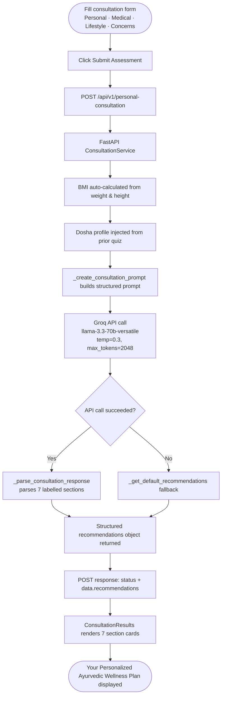

Mydva's Personal Consultation takes your completed Dosha Analysis one step further by combining your constitutional profile with your real-world health data — age, weight, diet, stress level, existing conditions, and primary concerns — and submitting the full picture to a Groq-hosted **Llama 3.3-70B** language model. The model acts as an experienced Ayurvedic practitioner, constructs a structured prompt from your data, and returns a 7-section wellness plan parsed into actionable recommendations. The whole cycle completes in under 30 seconds.

<Note>
  Complete the [Dosha Analysis](/guides/dosha-analysis) before starting a consultation. Your dosha percentages are automatically included in the LLM prompt, producing significantly more targeted advice than a consultation submitted without a dosha profile.
</Note>

## What the Personal Consultation does

When you submit the consultation form, Mydva's FastAPI backend builds a detailed prompt that includes your dosha distribution, BMI (auto-calculated from weight and height), lifestyle factors, medical conditions with their Ayurvedic context, and your stated health concerns. The prompt instructs Llama 3.3-70B to respond in seven labelled sections. The response is then parsed line-by-line into a structured object and rendered as individual recommendation cards inside the **Your Personalized Ayurvedic Wellness Plan** screen.

## How it uses Groq Llama 3.3-70B

The `RecommendationEngine` service calls the Groq API endpoint at `https://api.groq.com/openai/v1/chat/completions` using the `llama-3.3-70b-versatile` model with a temperature of `0.3` (low randomness for consistent, clinically grounded advice) and a maximum of `2048` output tokens. If the API call fails for any reason, the engine falls back to a default set of practitioner-referral recommendations so you always receive a usable result.

## Filling in the consultation form

<Steps>
  <Step title="Open the Consultation page">
    Navigate to **Personal Consultation** in the Mydva dashboard. If you have already completed the Dosha Analysis in the same session, your dosha profile is pre-loaded. The form is divided into four sections.
  </Step>

  <Step title="Enter your personal information">
    Fill in your basic biometric details. BMI is calculated automatically from your weight and height — you do not need to enter it.

    | Field | Type | Valid range | Notes |
    |---|---|---|---|
    | Age | Integer | 1–120 | Years |
    | Gender | Select | male / female / other | |
    | Weight | Decimal | 20–200 kg | |
    | Height | Decimal | 100–250 cm | |

  </Step>

  <Step title="Provide your medical history">
    Select any current health conditions from the multi-select list, then optionally list your current medications in the free-text field. Mydva includes Ayurvedic context for each condition in the LLM prompt.

    **Available conditions:** Diabetes · Hypertension · Arthritis · Digestive Issues · Respiratory Problems · Skin Conditions · Sleep Disorders · Stress/Anxiety · None

    Each condition carries a dedicated Ayurvedic interpretation. For example, Diabetes is framed as Prameha (primarily a Kapha disorder), and Arthritis is noted as Sandhivata (a Vata disorder with possible Ama accumulation). If none apply, select **None**.
  </Step>

  <Step title="Describe your lifestyle">
    Provide four lifestyle data points used to shape the exercise, diet, and routine recommendations:

    | Field | Options |
    |---|---|
    | Diet Type | Vegetarian · Vegan · Non-Vegetarian · Other |
    | Physical Activity | Sedentary · Light · Moderate · Active · Very Active |
    | Average Sleep Hours | Slider from 4 to 12 hours (0.5-hour increments, default 7) |
    | Stress Level | Low · Medium · High |

  </Step>

  <Step title="State your health concerns">
    Write a free-text description of your **Primary Health Concerns** (required — describe your main symptoms and goals) and optionally list any **Previous Treatments** you have already tried. The more specific you are here, the more targeted the LLM recommendations will be.
  </Step>

  <Step title="Submit the assessment">
    Click **Submit Assessment**. The button is disabled while the request is in flight to prevent duplicate submissions. Results appear automatically once the LLM response is parsed.
  </Step>
</Steps>

## Complete consultation flow



## Understanding your 7 output sections

The LLM response is parsed into the following sections, each rendered as its own card in the Mydva dashboard:

<Accordion title="1. Dosha Impact">
  Explains how your current dosha balance — including the percentages from your quiz — affects your specific health patterns. It describes which Vata, Pitta, or Kapha symptoms are most relevant to you and lists dosha-balancing priorities. This section also reflects any conditions you selected (for example, how elevated Vata amplifies anxiety or sleep irregularity).
</Accordion>

<Accordion title="2. Dietary Recommendations">
  Lists specific foods to include and avoid, best times and methods of consumption, quantity guidelines where applicable, and any special preparations or combinations (e.g. golden milk, medicated ghee). Recommendations align with both your dominant dosha and your selected diet type (Vegetarian, Vegan, Non-Vegetarian, or Other).
</Accordion>

<Accordion title="3. Lifestyle Modifications">
  Covers daily routine adjustments, the best times for various activities, duration and frequency of practices, and practical tips for implementation. Common items include dinacharya (Ayurvedic daily routine) suggestions, sleep hygiene, and season-specific guidance.
</Accordion>

<Accordion title="4. Exercise Recommendations">
  Specifies exercise types suited to your dosha and activity level, intensity and duration, the best times to practise, and any precautions or modifications for your listed health conditions.
</Accordion>

<Accordion title="5. Herbal Remedies">
  Names specific herbs or formulations with dosage, timing, method of preparation, duration of use, and the precise benefit for your constitution. Recommendations cross-reference with the six herbs available in Mydva's [Herbal Remedies Explorer](/guides/herbal-remedies).
</Accordion>

<Accordion title="6. Therapeutic Treatments">
  Recommends Ayurvedic therapies such as Abhyanga (oil massage), Panchakarma procedures, Shirodhara, or others appropriate for your dosha and conditions. Each therapy entry includes frequency, expected benefits, preparations needed, and precautions.
</Accordion>

<Accordion title="7. Warnings & Precautions">
  Lists specific contraindications, potential interactions between herbal recommendations and any medications you entered, warning signs to watch for, and guidance on when to seek additional help from a qualified practitioner.
</Accordion>

<Warning>
  The recommendations generated by Mydva's AI are for informational and educational purposes only. Always consult a licensed physician or qualified Ayurvedic practitioner before beginning any new herbal remedy, therapeutic treatment, or significant dietary change — especially if you are pregnant, nursing, or managing a chronic condition.
</Warning>

## API reference

### Request — `POST /api/v1/personal-consultation`

<ParamField body="personal_info" type="object" required>
  Basic biometric details. BMI should be pre-calculated by the client before submission.
  <Expandable title="PersonalInfo fields">
    <ParamField body="age" type="integer" required>
      Patient age in years. Range: 1–120.
    </ParamField>
    <ParamField body="gender" type="string" required>
      One of `"male"`, `"female"`, or `"other"` (case-insensitive).
    </ParamField>
    <ParamField body="weight" type="float" required>
      Body weight in kilograms. Range: 20–200.
    </ParamField>
    <ParamField body="height" type="float" required>
      Height in centimetres. Range: 100–250.
    </ParamField>
    <ParamField body="bmi" type="float" required>
      Body Mass Index, pre-calculated as `weight / (height_in_metres)²`.
    </ParamField>
  </Expandable>
</ParamField>

<ParamField body="medical_history" type="object" required>
  Current health conditions and medications.
  <Expandable title="MedicalHistory fields">
    <ParamField body="conditions" type="array of strings">
      Zero or more conditions from the predefined list: `"Diabetes"`, `"Hypertension"`, `"Arthritis"`, `"Digestive Issues"`, `"Respiratory Problems"`, `"Skin Conditions"`, `"Sleep Disorders"`, `"Stress/Anxiety"`, `"None"`. Defaults to an empty array.
    </ParamField>
    <ParamField body="medications" type="string">
      Free-text description of current medications. Optional; omit or pass `null` if none.
    </ParamField>
  </Expandable>
</ParamField>

<ParamField body="lifestyle" type="object" required>
  Daily lifestyle factors used to contextualise exercise and routine recommendations.
  <Expandable title="Lifestyle fields">
    <ParamField body="diet_type" type="string" required>
      One of `"Vegetarian"`, `"Vegan"`, `"Non-Vegetarian"`, or `"Other"`.
    </ParamField>
    <ParamField body="physical_activity" type="string" required>
      One of `"Sedentary"`, `"Light"`, `"Moderate"`, `"Active"`, or `"Very Active"`.
    </ParamField>
    <ParamField body="sleep_hours" type="integer" required>
      Average nightly sleep in hours. Range: 4–12.
    </ParamField>
    <ParamField body="stress_level" type="string" required>
      One of `"low"`, `"medium"`, or `"high"` (case-insensitive).
    </ParamField>
  </Expandable>
</ParamField>

<ParamField body="concerns" type="object" required>
  Primary health goals and treatment history.
  <Expandable title="HealthConcerns fields">
    <ParamField body="primary_concerns" type="string" required>
      Free-text description of the patient's main health concerns and symptoms.
    </ParamField>
    <ParamField body="previous_treatments" type="string">
      Free-text description of prior treatments or therapies. Optional; omit or pass `null` if none.
    </ParamField>
  </Expandable>
</ParamField>

**Full request example**

```json
{
  "personal_info": {
    "age": 34,
    "gender": "female",
    "weight": 58.0,
    "height": 165.0,
    "bmi": 21.3
  },
  "medical_history": {
    "conditions": ["Stress/Anxiety", "Sleep Disorders"],
    "medications": "None"
  },
  "lifestyle": {
    "diet_type": "Vegetarian",
    "physical_activity": "Light",
    "sleep_hours": 6,
    "stress_level": "high"
  },
  "concerns": {
    "primary_concerns": "Persistent fatigue, difficulty falling asleep, and frequent anxiety. Looking for natural ways to improve energy and mental calm.",
    "previous_treatments": "Tried melatonin supplements for 3 months with limited effect."
  }
}
```

### Response

```json
{
  "status": "success",
  "data": {
    "recommendations": {
      "overview": {
        "condition_analysis": [
          "Your Vata dominance influences your health patterns and tendencies.",
          "Current stress levels may be impacting your dosha balance and overall health.",
          "Your sleep patterns may need attention for optimal health."
        ],
        "dosha_impact": [
          "Elevated Vata amplifies anxiety and disrupts the natural sleep-wake cycle.",
          "High stress further deregulates Prana Vata, the sub-dosha governing the mind and nervous system."
        ]
      },
      "recommendations": {
        "dietary": [
          "Eat warm, unctuous, and easy-to-digest foods: kitchari, warm soups, and steamed root vegetables.",
          "Avoid cold beverages, raw salads, and excessive caffeine, which aggravate Vata.",
          "Consume a warm glass of ashwagandha milk (½ tsp powder + warm whole milk) 30 minutes before bed."
        ],
        "lifestyle": [
          "Follow a consistent daily schedule: wake, eat, and sleep at the same time each day.",
          "Practice Abhyanga (self-oil massage with warm sesame oil) each morning for 10–15 minutes before bathing.",
          "Limit screen exposure 1 hour before bed to support melatonin production."
        ],
        "exercise": [
          "Gentle yoga (Yin or Restorative) for 30 minutes, 5 days per week.",
          "Pranayama: Nadi Shodhana (alternate nostril breathing) for 10 minutes each morning.",
          "Avoid intense HIIT or high-cardio workouts, which over-stimulate Vata."
        ],
        "herbal": [
          "Ashwagandha (Withania somnifera) — 500 mg capsule or ½ tsp powder in warm milk at bedtime.",
          "Brahmi (Bacopa monnieri) — 300 mg standardised extract with breakfast for cognitive support.",
          "Jatamansi — 250 mg at bedtime to reduce nervous system over-activity."
        ],
        "therapeutic": [
          "Shirodhara — warm medicated oil poured continuously over the forehead; 45-minute sessions weekly for 4 weeks.",
          "Nasya — 2 drops of Anu Taila in each nostril each morning to calm Prana Vata."
        ]
      },
      "warnings": [
        "Do not combine ashwagandha with sedative medications without physician guidance.",
        "Brahmi may slow reaction time; avoid driving immediately after first-time use.",
        "Seek professional care if anxiety symptoms worsen or sleep deprivation leads to functional impairment."
      ]
    }
  },
  "error": null
}
```

<ResponseField name="status" type="string">
  `"success"` when the consultation completes; `"error"` if an exception was thrown.
</ResponseField>

<ResponseField name="data.recommendations" type="object">
  Top-level recommendations object containing `overview`, `recommendations`, and `warnings`.
</ResponseField>

<ResponseField name="data.recommendations.overview.condition_analysis" type="array of strings">
  Health status analysis lines derived from your reported conditions, dosha, and lifestyle factors.
</ResponseField>

<ResponseField name="data.recommendations.overview.dosha_impact" type="array of strings">
  Parsed LLM output explaining how your dosha state affects your current health.
</ResponseField>

<ResponseField name="data.recommendations.recommendations.dietary" type="array of strings">
  Specific dietary guidance lines parsed from the LLM response.
</ResponseField>

<ResponseField name="data.recommendations.recommendations.lifestyle" type="array of strings">
  Daily routine and lifestyle modification lines.
</ResponseField>

<ResponseField name="data.recommendations.recommendations.exercise" type="array of strings">
  Exercise type, intensity, frequency, and precaution lines.
</ResponseField>

<ResponseField name="data.recommendations.recommendations.herbal" type="array of strings">
  Named herb recommendations with dosage and preparation instructions.
</ResponseField>

<ResponseField name="data.recommendations.recommendations.therapeutic" type="array of strings">
  Ayurvedic therapy recommendations with frequency and benefit notes.
</ResponseField>

<ResponseField name="data.recommendations.warnings" type="array of strings">
  Contraindications, medication interactions, and when-to-seek-help guidance.
</ResponseField>

<ResponseField name="error" type="string | null">
  Error message if `status` is `"error"`; otherwise `null`.
</ResponseField>

## Tips for best results

- **Be honest about stress and sleep.** These two inputs directly influence whether the backend flags Vata and Pitta imbalance patterns in your condition analysis.
- **List all current medications.** The LLM checks for known herb-drug interactions and includes relevant warnings in the **Warnings & Precautions** section.
- **Use specific language in Primary Health Concerns.** Instead of "I feel tired," write "I feel fatigued after meals and have difficulty concentrating in the afternoon." Specific symptoms produce more precise herbal and dietary guidance.
- **Re-run after significant life changes.** If your diet, activity level, or health conditions change substantially, submit a new consultation to get updated recommendations.
- **Save your results.** Use the **Save Recommendations** button at the bottom of the results page to store your wellness plan for future reference.
