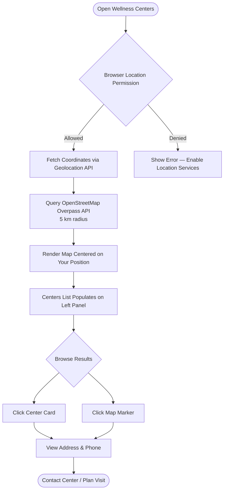

The Wellness Centers feature inside Mydva gives you an interactive, map-based directory of Ayurvedic clinics, Panchakarma centers, homeopathic centers, and general health facilities in your area. Instead of browsing static lists or searching across multiple websites, you can open the map, share your location, and instantly see every relevant center within a 5-kilometer radius — complete with the center's name, address, and phone number, all pulled in real time from OpenStreetMap's global health facility database.

## What the Wellness Centers Feature Is

Wellness Centers is a dedicated page in Mydva that combines GPS-based geolocation with a live OpenStreetMap tile layer to show you Ayurvedic and holistic health facilities near wherever you are. The interface splits into two panels: a scrollable list of center cards on the left, and a full interactive map on the right. Every center that appears in the list also appears as a pin on the map, and clicking either the card or the map marker opens the center's details.

## How to Access Wellness Centers

<Steps>
  <Step title="Open your Mydva dashboard">
    Sign in to your account and go to the main dashboard.
  </Step>
  <Step title="Click Wellness Centers in the navigation">
    In the left sidebar, select **Wellness Centers**. The page loads and immediately requests your browser's geolocation permission.
  </Step>
  <Step title="Allow location access">
    When your browser displays the location permission prompt, click **Allow**. Mydva uses your coordinates only to query nearby facilities — your location is not stored or shared. If you deny permission, an error message will prompt you to enable location services so the map can center correctly.
  </Step>
  <Step title="Wait for the map to load">
    A loading indicator appears while Mydva fetches nearby centers from the OpenStreetMap Overpass API. This typically takes five to ten seconds. Once complete, the map centers on your position and the center list populates on the left.
  </Step>
</Steps>

## What You Can Find

Mydva searches within a **5-kilometer radius** of your current location and returns results across four facility categories:

- **Ayurvedic centers** — Clinics tagged specifically as Ayurvedic healthcare facilities in the OpenStreetMap database.
- **Homeopathic centers** — Homeopathic clinics and dispensaries, which often carry complementary traditional remedies.
- **Hospitals** — General hospitals that may have Ayurveda or integrative medicine departments.
- **Clinics** — General medical clinics, including those offering traditional and alternative medicine services.

<Note>
  The number of results you see depends entirely on what is listed in the OpenStreetMap community database for your area. Urban areas in India typically show a rich set of Ayurvedic-specific results. If you are in a region with fewer tagged facilities, you may see primarily general clinics and hospitals. In that case, consider expanding your physical search radius by moving to a central location before opening the feature, or use the Expert Talk section for a remote consultation with a certified practitioner.
</Note>

## How Geolocation Works

When you grant permission, your browser calls the standard `navigator.geolocation` API to retrieve your latitude and longitude. Mydva sends those coordinates to the [OpenStreetMap Overpass API](https://overpass-api.de) using a structured query that requests all health-tagged nodes within 5,000 meters of your position. The API returns a JSON payload of matching map nodes, each carrying the facility's coordinates, name, address fields, phone number, and facility-type tag. Mydva then filters out any nodes that lack valid coordinate data and renders the remainder as markers on the Leaflet map tile.

Your position is shown on the map as a distinct green user-marker so you can immediately see your location relative to each nearby center.

## What Center Listings Include

Each center card in the left panel and each map popup shows:

| Field | Details |
|---|---|
| **Name** | The facility's registered or commonly used name (e.g., "Dhanvantari Ayurveda Clinic"). Falls back to "Health Center" if no name is tagged. |
| **Type** | The OpenStreetMap category: `ayurvedic`, `homeopathic`, `hospital`, or `clinic`. |
| **Address** | Full street address when available. Falls back to street name or "Address not available" if the facility has not been fully tagged in OpenStreetMap. |
| **Phone** | Primary contact number when available. Falls back to "Contact not available". |

Clicking a map marker opens a popup that repeats the name, address, and phone number so you can read the details without scrolling away from the map.

## Wellness Centers Flow

## Tips on What to Look for in an Ayurvedic Center

<Accordion title="Verify the practitioner's credentials">
  In India, qualified Ayurvedic doctors hold a **BAMS** (Bachelor of Ayurvedic Medicine and Surgery) degree from a recognized university and are registered with their state's Ayurvedic Medical Council. When you contact a center, ask about the lead practitioner's qualifications before booking an in-person appointment.
</Accordion>

<Accordion title="Ask about Panchakarma facilities">
  Panchakarma — the classical five-action detoxification and rejuvenation therapy — requires a dedicated treatment room, trained therapists, and specific herbal preparations. Not every Ayurvedic clinic offers the full protocol. If you are looking for Panchakarma specifically, confirm that the center has trained Panchakarma therapists and an appropriately equipped treatment space.
</Accordion>

<Accordion title="Check consultation availability and wait times">
  Popular Ayurvedic clinics often have waiting periods of several days to weeks for new patient appointments. Call the center directly using the phone number shown in the listing to check current availability before making a trip in person.
</Accordion>

<Accordion title="Look for a holistic approach to treatment">
  A high-quality Ayurvedic center will assess your Prakriti (constitutional type) and Vikriti (current imbalance state) before recommending any treatment. Be cautious of centers that prescribe the same herbal formulas to every patient without an individual assessment.
</Accordion>

<Tip>
  If no Ayurvedic-specific centers appear near you, or if you would prefer the convenience of a remote consultation first, use Mydva's **Expert Talk** feature to book a video call with a certified Ayurvedic practitioner. A remote consultation can help you understand exactly what type of in-person treatment to look for before you visit a local center.
</Tip>
