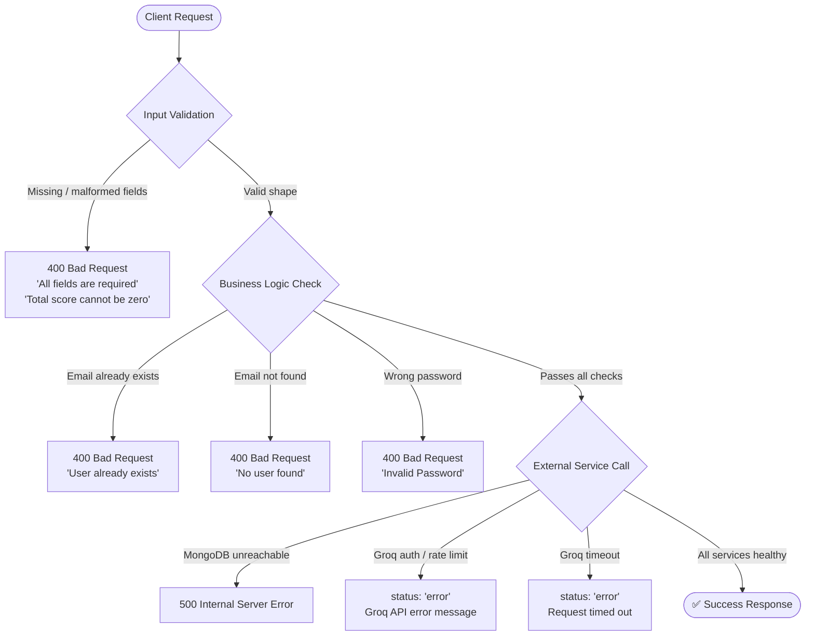

Mydva surfaces errors in two ways: HTTP status codes with JSON bodies from the Auth and AI backends, and in-app messages from the React frontend for client-side issues such as camera access and WebRTC connectivity. This reference covers every common error you are likely to encounter, explains what caused it, and tells you exactly how to fix it. For configuration-related errors that prevent services from starting at all, see the [Environment Variables](/configuration/environment-variables) and [Setup Guide](/configuration/setup) pages.

<Note>
When you encounter an unexpected error, open your browser's developer tools (F12 on most browsers) and check the **Console** and **Network** tabs. The Console shows JavaScript errors and failed API calls. The Network tab shows the full request and response for every API call, including the exact error message returned by the backend — which is often more specific than what the UI displays.
</Note>

---

## Auth Backend Errors

These errors are returned by the Node.js Auth Backend at `http://localhost:3000` (or your configured `REACT_APP_AUTH_API`). All responses follow the shape `{ "message": "..." }` with an appropriate HTTP status code.

| Status | Message | Cause | Resolution |
|---|---|---|---|
| `400` | `"All fields are required"` | The registration request body is missing one or more of `FullName`, `Email`, or `Password`. | Ensure all three fields are filled in the registration form. If you are calling the API directly, check that your JSON body includes all three keys with non-empty string values. |
| `400` | `"User already exists"` | The submitted email address is already associated with a registered Mydva account. | Use the **Login** form instead of Register. If you have forgotten your password, use the **Forgot Password** link on the login page. |
| `400` | `"No user found"` | The email address submitted to the login endpoint does not match any record in the database. | Verify the email you are entering. If you have not yet created an account, go to the **Register** page. |
| `400` | `"Invalid Password"` | The password submitted to the login endpoint does not match the stored bcrypt hash for that account. | Re-enter your password carefully, checking for caps lock. Use **Forgot Password** if you cannot remember it. |
| `500` | `"Internal server error"` | An unexpected condition occurred on the server — most commonly a lost MongoDB connection or an unhandled exception. | Wait a moment and retry the request. If you are self-hosting, check that `mongod` is running and that `MONGO_URI` in `AuthBackend/.env` is correct. Examine the Auth backend's terminal output for a stack trace. |

---

## AI API Errors

These errors come from the Python FastAPI Backend at `http://localhost:8080/api/v1`. Responses use the shape `{ "status": "error", "error": "..." }` for failures and `{ "status": "success", ... }` for successful responses.

### `status: "error"` with an error message

**What it means:** The AI backend encountered a problem processing your request. The `error` field in the response body contains a human-readable description.

**Common causes:**
- **Groq API key issue** — The `GROQ_API_KEY` in `PythonBackend/.env` is missing, malformed, or has been revoked. The Groq SDK raises an authentication error that the backend surfaces here.
- **Groq rate limit exceeded** — You have exceeded the per-minute token or request quota for your Groq tier. The error message will typically contain `rate_limit` or `429`.
- **Request timeout** — The LLM took too long to respond (common under heavy load). The backend times out and returns this error.
- **Malformed request payload** — The JSON body sent to `/personal-consultation` or `/analyze-dosha` did not match the expected Pydantic schema.

**How to resolve:**
1. Check that `GROQ_API_KEY` is set correctly in `PythonBackend/.env` and that the key is active at [console.groq.com](https://console.groq.com).
2. If you hit a rate limit, wait 60 seconds and retry.
3. For timeouts, retry once. If timeouts are frequent in production, consider upgrading your Groq plan or optimising your request payload.
4. If the error message references a specific field name, verify that your request body matches the expected schema shown in the FastAPI docs at `http://localhost:8080/docs`.

### `"Total score cannot be zero"`

**What it means:** The `/analyze-dosha` endpoint received a Dosha quiz submission in which the computed total score across all three Doshas sums to zero. The algorithm cannot calculate percentage distributions from a zero-sum input.

**What caused it:** Every answer in the submitted quiz was scored at zero, which happens when the quiz form is submitted before the user has interacted with the sliders or selection controls — sending all default zero values.

**How to resolve:** Answer all questions in the Dosha Quiz before submitting. Each question requires at least one non-zero selection. If you are calling the API directly for testing, ensure your payload contains realistic non-zero integer scores for `vata`, `pitta`, and `kapha` fields.

---

## Video Call Errors

These errors are client-side and appear as in-app banners or browser permission prompts rather than API responses.

### Camera or microphone permission denied

**What it means:** Your browser blocked Mydva's request to access your camera or microphone, preventing the WebRTC session from starting.

**What caused it:** Either you clicked **Block** when the browser first asked for permission, or a previously set block rule is in effect for the Mydva domain.

**How to resolve:**
1. Click the **camera icon** (or lock/info icon) in your browser's address bar.
2. Find the Camera and Microphone permissions and set both to **Allow**.
3. Reload the page — permission changes take effect on the next page load.
4. On macOS, also check **System Preferences → Privacy & Security → Camera** and **Microphone** to confirm your browser is listed and enabled at the OS level.

### WebRTC connection failed

**What it means:** The browser was able to access your camera and microphone, but could not establish a peer-to-peer connection with the other participant.

**What caused it:** WebRTC connections use STUN/TURN negotiation to traverse NAT. Strict corporate firewalls, VPNs, or symmetric NAT configurations (common on enterprise networks) can block the UDP ports WebRTC relies on.

**How to resolve:**
1. **Disable VPN** temporarily and retry — VPNs often interfere with WebRTC traffic.
2. **Switch networks** — try a mobile hotspot to confirm the issue is network-related.
3. **Use a supported browser** on the same network as your practitioner (Chrome or Edge are most reliable for WebRTC NAT traversal).
4. If the issue is specific to a corporate network, ask your IT department to whitelist UDP traffic on ports 3478 and 5349 (standard STUN/TURN ports).

---

## Error Flow Reference

The diagram below shows the request lifecycle for API calls, illustrating where each class of error can occur.

